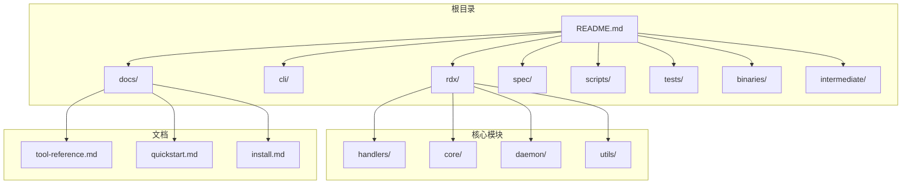
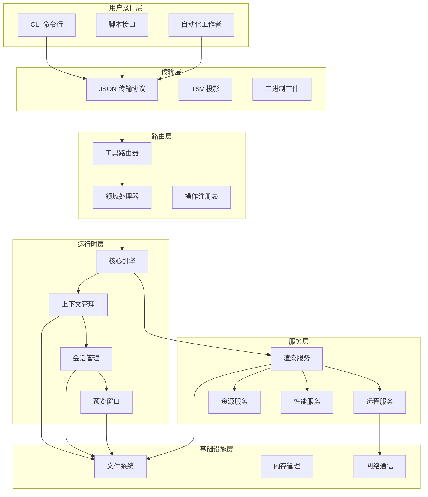
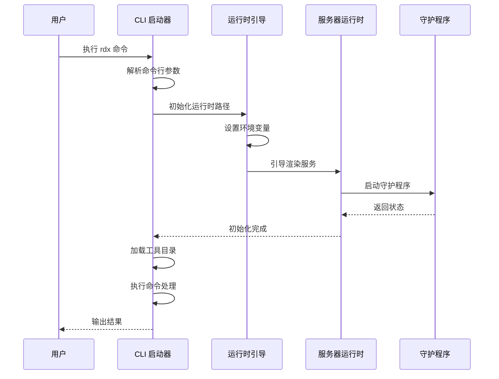
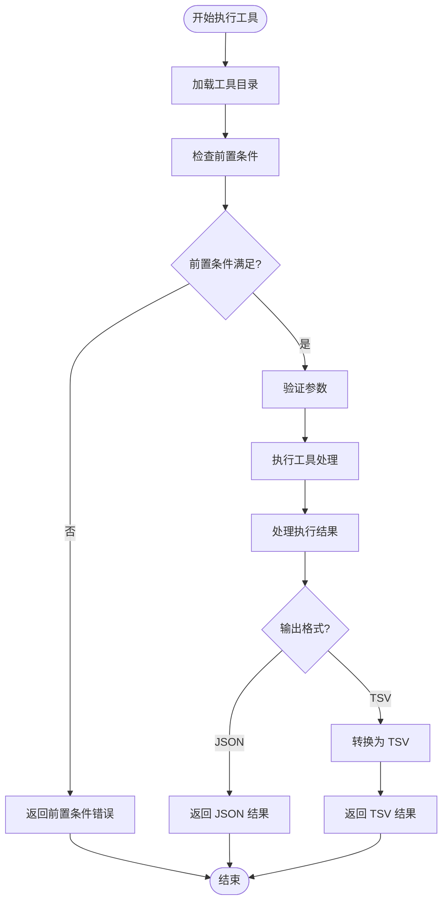
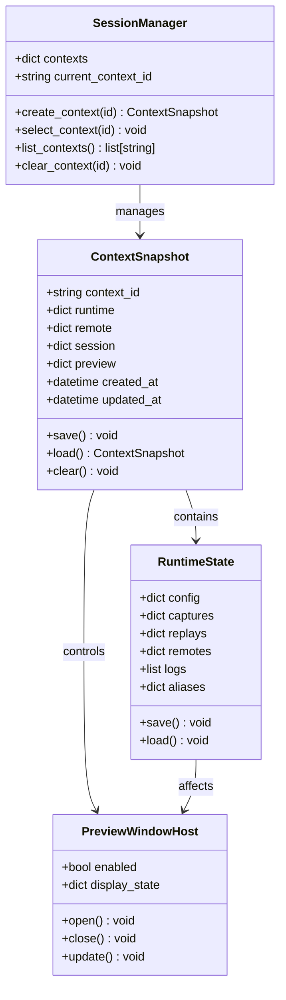
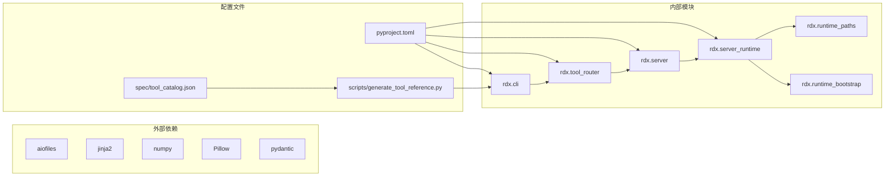
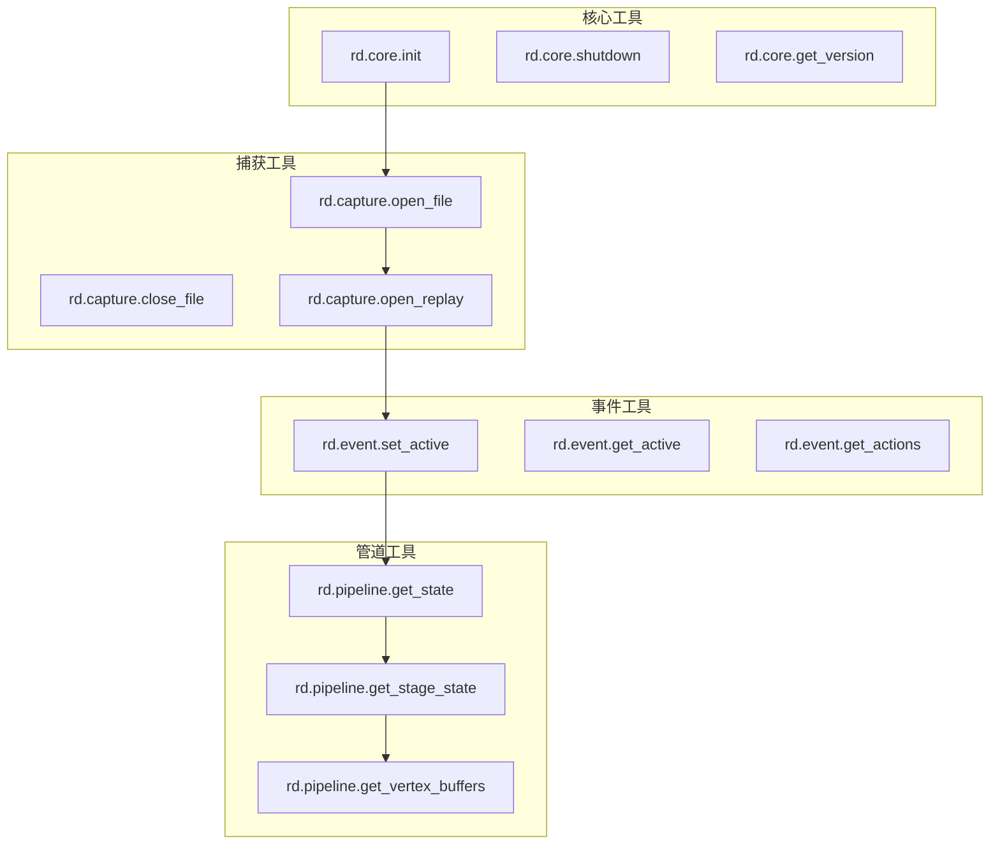

# 工具参考

<cite>
**本文档引用的文件**
- [README.md](file://README.md)
- [docs/tool-reference.md](file://docs/tool-reference.md)
- [docs/quickstart.md](file://docs/quickstart.md)
- [docs/install.md](file://docs/install.md)
- [cli/run_cli.py](file://cli/run_cli.py)
- [rdx/cli.py](file://rdx/cli.py)
- [rdx/tool_router.py](file://rdx/tool_router.py)
- [rdx/server.py](file://rdx/server.py)
- [rdx/server_runtime.py](file://rdx/server_runtime.py)
- [rdx/runtime_paths.py](file://rdx/runtime_paths.py)
- [rdx/runtime_bootstrap.py](file://rdx/runtime_bootstrap.py)
- [spec/tool_catalog.json](file://spec/tool_catalog.json)
- [scripts/generate_tool_reference.py](file://scripts/generate_tool_reference.py)
- [pyproject.toml](file://pyproject.toml)
</cite>

## 目录
1. [简介](#简介)
2. [项目结构](#项目结构)
3. [核心组件](#核心组件)
4. [架构概览](#架构概览)
5. [详细组件分析](#详细组件分析)
6. [依赖关系分析](#依赖关系分析)
7. [性能考虑](#性能考虑)
8. [故障排除指南](#故障排除指南)
9. [结论](#结论)
10. [附录](#附录)

## 简介
RDX Tools 是一个基于命令行界面（CLI）的 RenderDoc .rdc 运行时包，专为 Windows x64 本地回放和远程 Android 回放设计。该项目提供了 194 个 JSON 优先的 `rd.*` 工具，通过 `rdx` 命令暴露，支持 GPU 调试、着色器分析、资源检查、性能分析等全面的图形调试功能。

该项目采用本地优先的设计理念，确保在没有外部依赖的情况下即可运行，特别适合自动化脚本和 CI/CD 流水线使用。

## 项目结构
项目采用模块化的架构设计，主要包含以下核心目录：



**图表来源**
- [README.md:1-68](file://README.md#L1-L68)
- [pyproject.toml:1-45](file://pyproject.toml#L1-L45)

**章节来源**
- [README.md:1-68](file://README.md#L1-L68)
- [pyproject.toml:1-45](file://pyproject.toml#L1-L45)

## 核心组件
RDX Tools 的核心组件包括工具目录、运行时系统、处理器路由和预检机制：

### 工具目录系统
- **工具分类**：194 个工具分布在 17 个功能组中
- **命名空间**：采用 `rd.domain.action` 的标准化命名
- **参数系统**：每个工具都有详细的参数定义和前置条件检查

### 运行时系统
- **上下文管理**：支持多个隔离的 CLI 守护程序上下文
- **会话状态**：跟踪当前捕获、会话 ID、预览状态等
- **远程支持**：集成 Android 远程调试功能

### 处理器路由
- **领域处理器**：针对不同功能域（核心、捕获、事件、管道等）的专门处理器
- **前置条件检查**：在执行前验证必需的运行时状态
- **错误处理**：提供结构化的错误响应和恢复建议

**章节来源**
- [docs/tool-reference.md:1-311](file://docs/tool-reference.md#L1-L311)
- [spec/tool_catalog.json:1-800](file://spec/tool_catalog.json#L1-L800)
- [rdx/tool_router.py:1-151](file://rdx/tool_router.py#L1-L151)

## 架构概览
RDX Tools 采用分层架构设计，从 CLI 接口到底层渲染服务：



**图表来源**
- [rdx/cli.py:1-800](file://rdx/cli.py#L1-L800)
- [rdx/server.py:1-148](file://rdx/server.py#L1-L148)
- [rdx/tool_router.py:1-151](file://rdx/tool_router.py#L1-L151)

## 详细组件分析

### CLI 启动流程
CLI 启动器负责初始化运行时环境并处理用户命令：



**图表来源**
- [cli/run_cli.py:226-291](file://cli/run_cli.py#L226-L291)
- [rdx/cli.py:240-262](file://rdx/cli.py#L240-L262)

### 工具执行流程
工具执行采用统一的前置条件检查和错误处理机制：



**图表来源**
- [rdx/tool_router.py:111-127](file://rdx/tool_router.py#L111-L127)
- [rdx/cli.py:382-392](file://rdx/cli.py#L382-L392)

### 上下文管理系统
上下文管理器提供多租户隔离和状态持久化：



**图表来源**
- [rdx/server_runtime.py:193-200](file://rdx/server_runtime.py#L193-L200)
- [rdx/server_runtime.py:133-157](file://rdx/server_runtime.py#L133-L157)

**章节来源**
- [cli/run_cli.py:1-291](file://cli/run_cli.py#L1-L291)
- [rdx/cli.py:1-800](file://rdx/cli.py#L1-L800)
- [rdx/tool_router.py:1-151](file://rdx/tool_router.py#L1-L151)
- [rdx/server_runtime.py:1-200](file://rdx/server_runtime.py#L1-L200)

## 依赖关系分析

### 核心依赖关系
项目采用松耦合的设计，主要依赖关系如下：



**图表来源**
- [pyproject.toml:13-19](file://pyproject.toml#L13-L19)
- [pyproject.toml:21-22](file://pyproject.toml#L21-L22)

### 工具依赖图
工具之间存在复杂的依赖关系，主要体现在前置条件和执行顺序上：



**图表来源**
- [spec/tool_catalog.json:123-381](file://spec/tool_catalog.json#L123-L381)

**章节来源**
- [pyproject.toml:1-45](file://pyproject.toml#L1-L45)
- [spec/tool_catalog.json:1-800](file://spec/tool_catalog.json#L1-L800)

## 性能考虑
RDX Tools 在设计时充分考虑了性能优化：

### 内存管理
- **工件存储**：使用临时目录存储大型工件文件，避免 JSON 过大
- **缓存策略**：实现回放缓存和资源缓存机制
- **内存映射**：对大文件使用内存映射技术

### 并发处理
- **异步执行**：使用 asyncio 处理并发操作
- **进度报告**：提供实时进度反馈
- **超时控制**：为长时间操作设置合理的超时机制

### I/O 优化
- **流式处理**：支持流式数据处理减少内存占用
- **批量操作**：提供批量工具减少调用开销
- **压缩存储**：使用压缩算法减少存储空间

## 故障排除指南

### 常见问题诊断
1. **运行时初始化失败**
   - 检查 RenderDoc 库文件完整性
   - 验证 Python 运行时环境
   - 确认权限设置正确

2. **工具执行错误**
   - 使用 `rdx --json doctor` 进行自检
   - 检查前置条件是否满足
   - 查看详细错误信息和恢复建议

3. **远程连接问题**
   - 验证网络连接稳定性
   - 检查设备序列号和端口配置
   - 确认防火墙设置

### 调试工具
- **健康检查**：`rdx --json doctor` 提供完整的环境检查
- **日志查看**：`rd.core.get_logs` 获取内部日志
- **状态查询**：`rdx context status` 查看当前状态

**章节来源**
- [rdx/cli.py:407-529](file://rdx/cli.py#L407-L529)
- [docs/tool-reference.md:245-260](file://docs/tool-reference.md#L245-L260)

## 结论
RDX Tools 提供了一个功能完整、设计精良的图形调试工具集。其核心优势包括：

1. **完整的功能覆盖**：194 个工具涵盖从基础调试到高级分析的各个方面
2. **可靠的架构设计**：模块化设计确保了系统的可维护性和扩展性
3. **友好的用户体验**：清晰的命令结构和详细的文档支持
4. **强大的自动化能力**：适合 CI/CD 流水线和自动化测试场景

该项目为 GPU 开发者和图形程序员提供了一个强大而易用的调试工具集，能够显著提高开发效率和问题诊断能力。

## 附录

### 工具分类概览
工具按照功能域进行分类，主要分为以下几类：

1. **核心与环境管理** (14 个工具)
2. **捕获文件与回放** (13 个工具)
3. **事件导航与 API 检查** (12 个工具)
4. **管线状态检查** (25 个工具)
5. **资源检查与历史** (12 个工具)
6. **纹理数据访问与分析** (11 个工具)
7. **缓冲区与网格数据访问** (9 个工具)
8. **着色器检查、反射与替换** (13 个工具)
9. **着色器调试** (13 个工具)
10. **性能与高级分析** (6 个工具)
11. **导出、报告与可复现打包** (12 个工具)
12. **远程连接与自动化捕获** (12 个工具)
13. **诊断工具** (11 个工具)
14. **专家级宏工作流** (10 个工具)
15. **通用辅助工具** (6 个工具)
16. **上下文快照工具** (11 个工具)
17. **VFS 导航工具** (4 个工具)

### 快速开始示例
```bash
# 基本信息查看
rdx --version
rdx version --json
rdx --json doctor

# 工具探索
rdx tools search pipeline --json
rdx tools list --json

# 捕获操作
rdx capture open --file "C:\path\sample.rdc" --frame-index 0

# 上下文管理
rdx context status --json
rdx context update --key notes --value "triaged" --json

# 预览功能
rdx session preview on
rdx session preview status
rdx session preview off
```

**章节来源**
- [docs/quickstart.md:1-49](file://docs/quickstart.md#L1-L49)
- [docs/tool-reference.md:11-32](file://docs/tool-reference.md#L11-L32)