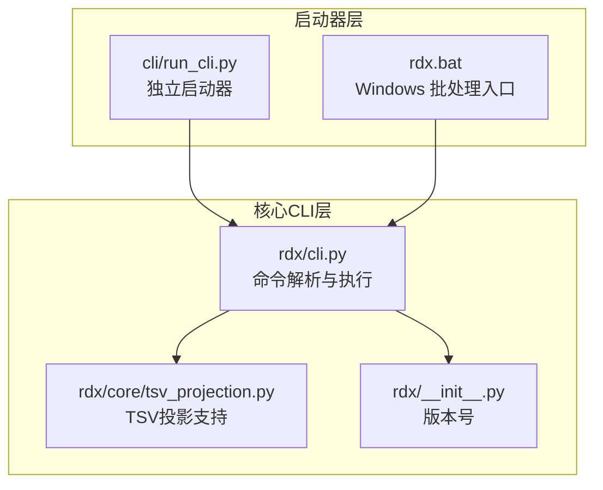
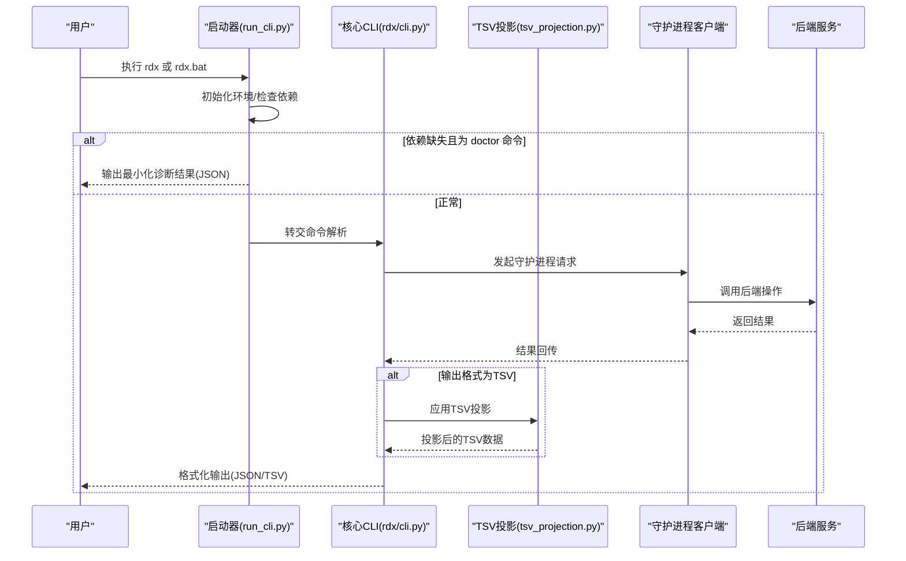
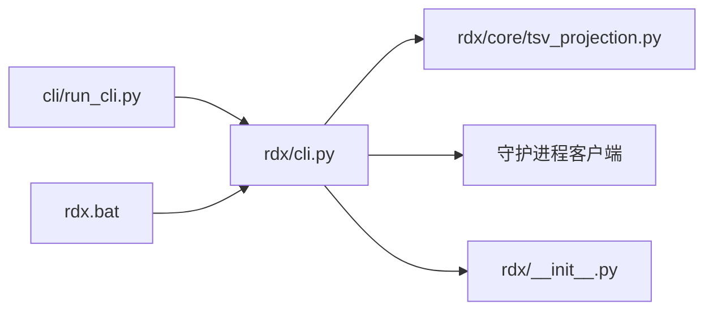

# CLI命令参考

<cite>
**本文引用的文件**
- [rdx/cli.py](file://rdx/cli.py)
- [cli/run_cli.py](file://cli/run_cli.py)
- [rdx/core/tsv_projection.py](file://rdx/core/tsv_projection.py)
- [rdx/__init__.py](file://rdx/__init__.py)
- [rdx.bat](file://rdx.bat)
- [scripts/smoke_cli.sh](file://scripts/smoke_cli.sh)
</cite>

## 目录
1. [简介](#简介)
2. [项目结构](#项目结构)
3. [核心组件](#核心组件)
4. [架构总览](#架构总览)
5. [详细组件分析](#详细组件分析)
6. [依赖分析](#依赖分析)
7. [性能考虑](#性能考虑)
8. [故障排查指南](#故障排查指南)
9. [结论](#结论)
10. [附录](#附录)

## 简介
本文件为 RDX Agent Tools 的 CLI 命令参考，覆盖基础命令、工具管理命令、会话控制命令与守护进程命令。内容基于仓库中的 CLI 实现与启动器，提供命令语法、参数、选项、输入输出格式、错误处理、使用示例与最佳实践。读者可据此快速掌握命令用法、组合使用方式以及在不同平台（Windows、POSIX Shell）下的运行方式。

**更新** 新增6个面向用户的友好CLI Facade（event、pipeline、shader、export、pixel、resource），这些命令映射到现有的rd.*工具，同时增强TSV投影支持功能。

## 项目结构
RDX CLI 由两层组成：
- 启动器层：独立的 Python 启动器负责环境初始化、依赖检查与版本信息输出。
- 核心 CLI 层：封装了所有命令的解析与执行逻辑，通过守护进程客户端与后端交互。



**图表来源**
- [cli/run_cli.py:1-290](file://cli/run_cli.py#L1-L290)
- [rdx/cli.py:1-1447](file://rdx/cli.py#L1-L1447)
- [rdx/core/tsv_projection.py](file://rdx/core/tsv_projection.py)
- [rdx/__init__.py:1-4](file://rdx/__init__.py#L1-L4)
- [rdx.bat](file://rdx.bat)

**章节来源**
- [cli/run_cli.py:1-290](file://cli/run_cli.py#L1-L290)
- [rdx/cli.py:1-1447](file://rdx/cli.py#L1-L1447)
- [rdx/core/tsv_projection.py](file://rdx/core/tsv_projection.py)
- [rdx/__init__.py:1-4](file://rdx/__init__.py#L1-L4)

## 核心组件
- 基础命令
  - 版本查询：显示工具版本与兼容性信息。
  - 自检诊断：检查运行时目录、Python 布局、RenderDoc 组件、工具目录与守护进程状态等。
  - 补全生成：按 Shell 生成自动补全脚本。
- 工具管理命令
  - 列表与搜索：列出或按关键字搜索已安装工具。
- 守护进程命令
  - 启动、停止、状态查询；支持附加/心跳/分离等高级操作。
- 会话控制命令
  - 预览开关与状态查询；上下文状态查看、更新、列举与清理。
- 通用调用命令
  - 调用任意后端操作，支持 JSON 参数传递与输出格式化。
- 文件系统命令
  - VFS 列表、树形浏览、解析路径等。
- 捕获与差异/断言命令
  - 打开捕获文件、查询状态；对管线与图像进行差异与断言。
- **新增** CLI Facade命令族
  - 事件命令：event（映射到rd.event.*工具）
  - 管线命令：pipeline（映射到rd.pipeline.*工具）
  - 着色器命令：shader（映射到rd.shader.*工具）
  - 导出命令：export（映射到rd.export.*工具）
  - 像素命令：pixel（映射到rd.pixel.*工具）
  - 资源命令：resource（映射到rd.resource.*工具）
- **新增** TSV投影支持
  - 所有命令支持TSV输出格式，提供结构化数据导出能力

**章节来源**
- [rdx/cli.py:62-94](file://rdx/cli.py#L62-L94)
- [rdx/cli.py:392-516](file://rdx/cli.py#L392-L516)
- [rdx/cli.py:540-547](file://rdx/cli.py#L540-L547)
- [rdx/cli.py:645-648](file://rdx/cli.py#L645-L648)
- [rdx/cli.py:650-706](file://rdx/cli.py#L650-L706)
- [rdx/cli.py:1201-1218](file://rdx/cli.py#L1201-L1218)
- [rdx/cli.py:1219-770](file://rdx/cli.py#L1219-L770)
- [rdx/cli.py:821-842](file://rdx/cli.py#L821-L842)
- [rdx/cli.py:834-842](file://rdx/cli.py#L834-L842)
- [rdx/cli.py:844-1222](file://rdx/cli.py#L844-L1222)
- [rdx/cli.py:1068-1141](file://rdx/cli.py#L1068-L1141)
- [rdx/cli.py:1107-1141](file://rdx/cli.py#L1107-L1141)

## 架构总览
CLI 的整体调用链如下：



**图表来源**
- [cli/run_cli.py:225-282](file://cli/run_cli.py#L225-L282)
- [rdx/cli.py:226-247](file://rdx/cli.py#L226-L247)
- [rdx/core/tsv_projection.py](file://rdx/core/tsv_projection.py)

**章节来源**
- [cli/run_cli.py:225-282](file://cli/run_cli.py#L225-L282)
- [rdx/cli.py:226-247](file://rdx/cli.py#L226-L247)

## 详细组件分析

### 基础命令

#### 版本命令
- 语法
  - rdx version [--json]
- 选项
  - --json：以 JSON 格式输出版本信息
- 输入
  - 无
- 输出
  - 文本模式：打印版本号
  - JSON 模式：返回包含工具版本、架构、入口点与兼容性信息的对象
- 错误处理
  - 无运行时错误，失败情况由上层启动器处理
- 使用示例
  - rdx version
  - rdx version --json

**章节来源**
- [rdx/cli.py:540-547](file://rdx/cli.py#L540-L547)
- [cli/run_cli.py:164-196](file://cli/run_cli.py#L164-L196)
- [rdx/__init__.py:1-4](file://rdx/__init__.py#L1-L4)

#### 自检诊断命令
- 语法
  - rdx doctor
- 选项
  - --json：以 JSON 格式输出诊断详情
- 输入
  - 无
- 输出
  - 成功：包含 Python 布局、RenderDoc 组件、工具目录、守护进程状态、入口点存在性等字段
  - 失败：返回"设置不完整"的错误对象
- 错误处理
  - 依赖缺失、Python 布局不正确、RenderDoc 组件缺失、工具入口不存在等情况均会触发错误
- 使用示例
  - rdx doctor
  - rdx --json doctor

**章节来源**
- [rdx/cli.py:392-516](file://rdx/cli.py#L392-L516)
- [cli/run_cli.py:198-223](file://cli/run_cli.py#L198-L223)

#### 补全命令
- 语法
  - rdx completion <shell>
- 可选值
  - powershell、bash、zsh、fish
- 输入
  - 无
- 输出
  - 生成对应 Shell 的自动补全脚本文本
- 错误处理
  - 不支持的 Shell 将报错
- 使用示例
  - rdx completion powershell

**章节来源**
- [rdx/cli.py:645-648](file://rdx/cli.py#L645-L648)
- [rdx/cli.py:601-643](file://rdx/cli.py#L601-L643)

### 工具管理命令

#### 工具列表
- 语法
  - rdx tools list [--namespace <ns>] [--limit <n>] [--json]
- 选项
  - --namespace：按命名空间过滤
  - --limit：限制返回数量
  - --json：以 JSON 格式输出
- 输入
  - 无
- 输出
  - 成功：包含工具计数与工具数组（名称、分组、描述、参数名、前置条件）
- 错误处理
  - 无运行时错误
- 使用示例
  - rdx tools list --json
  - rdx tools list --namespace rd.pipeline --limit 5 --json

**章节来源**
- [rdx/cli.py:650-668](file://rdx/cli.py#L650-L668)

#### 工具搜索
- 语法
  - rdx tools search <query> [--limit <n>] [--json]
- 选项
  - --limit：限制返回数量
  - --json：以 JSON 格式输出
- 输入
  - 查询词
- 输出
  - 成功：包含查询词、工具计数与匹配工具数组
- 错误处理
  - 缺少查询词时返回验证错误
- 使用示例
  - rdx tools search pipeline --json
  - rdx tools search shader --limit 10 --json

**章节来源**
- [rdx/cli.py:670-706](file://rdx/cli.py#L670-L706)

### 守护进程命令

#### 守护进程生命周期
- 语法
  - rdx daemon start [--pipe-name <name>] [--owner-pid <pid>]
  - rdx daemon stop
  - rdx daemon status
- 选项
  - --pipe-name：管道名（启动时）
  - --owner-pid：启动时指定拥有者进程 ID（用于自动停止）
- 输入
  - 无（除 start）
- 输出
  - 成功：返回守护进程运行状态与当前状态快照
  - 失败：返回错误对象（含清理提示）
- 错误处理
  - 状态查询异常时尝试清理陈旧状态并重试
- 使用示例
  - rdx daemon start --daemon-context local
  - rdx daemon status --daemon-context local

**章节来源**
- [rdx/cli.py:1201-1218](file://rdx/cli.py#L1201-L1218)
- [rdx/cli.py:250-292](file://rdx/cli.py#L250-L292)

#### 守护进程高级操作
- 语法
  - rdx daemon attach --client-id <id> [--client-type <type>] [--pid <num>] [--lease-timeout-seconds <sec>]
  - rdx daemon heartbeat --client-id <id> [--pid <num>]
  - rdx daemon detach --client-id <id>
  - rdx daemon cleanup
- 输入
  - 客户端标识与可选参数
- 输出
  - 成功：返回相应操作的结果
- 错误处理
  - 无直接错误处理，失败由守护进程客户端包装
- 使用示例
  - rdx daemon attach --client-id cli-001 --daemon-context local

**章节来源**
- [rdx/cli.py:1207-1217](file://rdx/cli.py#L1207-L1217)

### 会话控制命令

#### 预览控制
- 语法
  - rdx session preview on|off|status
- 输入
  - 子命令：on、off、status
- 输出
  - 成功：返回预览状态
- 错误处理
  - 无运行时错误
- 使用示例
  - rdx session preview on
  - rdx session preview status

**章节来源**
- [rdx/cli.py:991-1010](file://rdx/cli.py#L991-L1010)

#### 上下文管理
- 语法
  - rdx context status [--json]
  - rdx context update --key <k> --value <v> [--json]
  - rdx context list [--json]
  - rdx context clear
- 输入
  - update 需要键值对
- 输出
  - 成功：返回上下文快照或操作结果
- 错误处理
  - 无会话时返回"需要会话"的错误提示
- 使用示例
  - rdx context update --key notes --value triaged --json
  - rdx context clear

**章节来源**
- [rdx/cli.py:734-770](file://rdx/cli.py#L734-L770)
- [rdx/cli.py:741-748](file://rdx/cli.py#L741-L748)
- [rdx/cli.py:750-755](file://rdx/cli.py#L750-L755)
- [rdx/cli.py:757-770](file://rdx/cli.py#L757-L770)

### 通用调用命令

#### call 命令
- 语法
  - rdx call <operation> [--args-json <json>|--args-file <path>] [--format json|tsv] [--remote] [--daemon-context <id>]
- 选项
  - --args-json：内联 JSON 参数
  - --args-file：参数文件路径
  - --format：输出格式（json、tsv）
  - --remote：远程模式
  - --daemon-context：守护进程上下文
- 输入
  - 操作名与参数
- 输出
  - 成功：根据 --format 输出 JSON 或 TSV
  - 失败：返回错误对象
- 错误处理
  - 参数互斥校验、JSON 解析失败、TSV 投影缺失等
- 使用示例
  - rdx call rd.session.get_context --args-file ./args.json --format json
  - rdx call rd.vfs.ls --args-json '{"path":"/"}' --format tsv

**章节来源**
- [rdx/cli.py:821-832](file://rdx/cli.py#L821-L832)
- [rdx/cli.py:313-378](file://rdx/cli.py#L313-L378)

### 文件系统命令

#### VFS 命令族
- 语法
  - rdx vfs ls|cat|tree|resolve [--path <path>] [--depth <n>] [--format json|tsv] [--daemon-context <id>]
- 选项
  - --path：目标路径
  - --depth：树形深度（tree）
  - --format：输出格式
  - --daemon-context：守护进程上下文
- 输入
  - 子命令与路径
- 输出
  - 成功：根据 --format 输出
- 错误处理
  - 无运行时错误
- 使用示例
  - rdx vfs ls --path / --format tsv
  - rdx vfs tree --path / --depth 2 --format json

**章节来源**
- [rdx/cli.py:834-842](file://rdx/cli.py#L834-L842)

### 捕获与差异/断言命令

#### 捕获命令
- 语法
  - rdx capture open --file <path> [--frame-index <n>] [--preview] [--daemon-context <id>]
  - rdx capture status
- 选项
  - --file：捕获文件路径
  - --frame-index：帧索引
  - --preview：打开预览
- 输入
  - 捕获文件路径与可选参数
- 输出
  - 成功：返回捕获状态与上下文快照
- 错误处理
  - 多步骤失败时返回详细错误与恢复建议
- 使用示例
  - rdx capture open --file D:\path\capture.rdc --frame-index 0 --preview
  - rdx capture status

**章节来源**
- [rdx/cli.py:844-1222](file://rdx/cli.py#L844-L1222)
- [rdx/cli.py:717-725](file://rdx/cli.py#L717-L725)

#### 差异与断言
- 语法
  - rdx diff pipeline|image <args...>
  - rdx assert pipeline|image <args...>
- 输入
  - 具体子命令与参数（详见后端工具定义）
- 输出
  - 成功：返回比较/断言结果
- 错误处理
  - 无运行时错误
- 使用示例
  - rdx diff pipeline --args-json '{"..."}' --format json
  - rdx assert image --args-json '{"..."}' --format json

**章节来源**
- [rdx/cli.py:1068-1141](file://rdx/cli.py#L1068-L1141)
- [rdx/cli.py:1107-1141](file://rdx/cli.py#L1107-L1141)

### **新增** CLI Facade命令族

#### 事件命令（event）
- 语法
  - rdx event <subcommand> [args...] [--format json|tsv]
- 子命令
  - list：列出事件
  - get：获取特定事件
  - filter：按条件过滤事件
- 选项
  - --format：输出格式（json、tsv）
- 输入
  - 事件操作参数
- 输出
  - 成功：根据 --format 输出事件数据
  - 失败：返回错误对象
- 错误处理
  - 无运行时错误
- 使用示例
  - rdx event list --format tsv
  - rdx event get --event-id 123 --format json

**章节来源**
- [rdx/cli.py:1219-770](file://rdx/cli.py#L1219-L770)

#### 管线命令（pipeline）
- 语法
  - rdx pipeline <subcommand> [args...] [--format json|tsv]
- 子命令
  - list：列出管线
  - get：获取特定管线
  - validate：验证管线配置
- 选项
  - --format：输出格式（json、tsv）
- 输入
  - 管线操作参数
- 输出
  - 成功：根据 --format 输出管线数据
  - 失败：返回错误对象
- 错误处理
  - 无运行时错误
- 使用示例
  - rdx pipeline list --format tsv
  - rdx pipeline validate --pipeline-id main --format json

**章节来源**
- [rdx/cli.py:1219-770](file://rdx/cli.py#L1219-L770)

#### 着色器命令（shader）
- 语法
  - rdx shader <subcommand> [args...] [--format json|tsv]
- 子命令
  - list：列出着色器
  - get：获取特定着色器
  - disassemble：反汇编着色器代码
- 选项
  - --format：输出格式（json、tsv）
- 输入
  - 着色器操作参数
- 输出
  - 成功：根据 --format 输出着色器数据
  - 失败：返回错误对象
- 错误处理
  - 无运行时错误
- 使用示例
  - rdx shader list --format tsv
  - rdx shader disassemble --shader-id vertex --format json

**章节来源**
- [rdx/cli.py:1219-770](file://rdx/cli.py#L1219-L770)

#### 导出命令（export）
- 语法
  - rdx export <subcommand> [args...] [--format json|tsv]
- 子命令
  - capture：导出捕获数据
  - screenshot：导出截图
  - geometry：导出几何数据
- 选项
  - --format：输出格式（json、tsv）
- 输入
  - 导出操作参数
- 输出
  - 成功：根据 --format 输出导出数据
  - 失败：返回错误对象
- 错误处理
  - 无运行时错误
- 使用示例
  - rdx export capture --output-dir ./exports --format tsv
  - rdx export screenshot --frame-index 0 --format json

**章节来源**
- [rdx/cli.py:1219-770](file://rdx/cli.py#L1219-L770)

#### 像素命令（pixel）
- 语法
  - rdx pixel <subcommand> [args...] [--format json|tsv]
- 子命令
  - sample：采样像素值
  - compare：比较像素数据
  - histogram：生成像素直方图
- 选项
  - --format：输出格式（json、tsv）
- 输入
  - 像素操作参数
- 输出
  - 成功：根据 --format 输出像素数据
  - 失败：返回错误对象
- 错误处理
  - 无运行时错误
- 使用示例
  - rdx pixel sample --x 100 --y 100 --format tsv
  - rdx pixel compare --reference ./ref.png --format json

**章节来源**
- [rdx/cli.py:1219-770](file://rdx/cli.py#L1219-L770)

#### 资源命令（resource）
- 语法
  - rdx resource <subcommand> [args...] [--format json|tsv]
- 子命令
  - list：列出资源
  - get：获取特定资源
  - stats：获取资源统计信息
- 选项
  - --format：输出格式（json、tsv）
- 输入
  - 资源操作参数
- 输出
  - 成功：根据 --format 输出资源数据
  - 失败：返回错误对象
- 错误处理
  - 无运行时错误
- 使用示例
  - rdx resource list --format tsv
  - rdx resource stats --resource-id texture0 --format json

**章节来源**
- [rdx/cli.py:1219-770](file://rdx/cli.py#L1219-L770)

### **新增** TSV投影支持

#### TSV输出格式
- 语法
  - 所有命令支持 --format tsv 选项
- 功能特性
  - 结构化数据导出
  - 机器可读格式
  - 支持批量处理
- 使用示例
  - rdx tools list --format tsv
  - rdx event list --format tsv
  - rdx pipeline list --format tsv

**章节来源**
- [rdx/cli.py:313-378](file://rdx/cli.py#L313-L378)
- [rdx/core/tsv_projection.py](file://rdx/core/tsv_projection.py)

## 依赖分析
- CLI 与启动器的耦合
  - 启动器负责环境初始化与依赖检查，核心 CLI 仅处理命令解析与执行。
- CLI 与守护进程的耦合
  - 大多数命令通过守护进程客户端转发到后端服务，保证一致性与隔离性。
- **新增** TSV投影模块集成
  - TSV投影支持作为独立模块集成到CLI执行流程中
- 平台入口
  - Windows 提供 rdx.bat 批处理入口；POSIX 环境通过 bin/rdx 或 Python 启动器。



**图表来源**
- [cli/run_cli.py:225-282](file://cli/run_cli.py#L225-L282)
- [rdx/cli.py:17-46](file://rdx/cli.py#L17-L46)
- [rdx/core/tsv_projection.py](file://rdx/core/tsv_projection.py)
- [rdx/__init__.py:1-4](file://rdx/__init__.py#L1-L4)
- [rdx.bat](file://rdx.bat)

**章节来源**
- [cli/run_cli.py:225-282](file://cli/run_cli.py#L225-L282)
- [rdx/cli.py:17-46](file://rdx/cli.py#L17-L46)

## 性能考虑
- 输出格式选择
  - TSV 适合批量处理与脚本解析，但要求后端提供投影；JSON 更通用。
- **新增** TSV投影性能优化
  - TSV投影在内存中进行，避免额外的序列化开销
  - 支持流式输出，减少大文件处理的内存占用
- 超时策略
  - 守护进程执行超时依据操作类型动态计算，避免长时间阻塞。
- I/O 优化
  - 参数文件读取采用 UTF-8-SIG 支持，减少编码问题。
- 进程生命周期
  - 启动时可指定 owner-pid，便于自动停止与资源回收。

**章节来源**
- [rdx/cli.py:313-378](file://rdx/cli.py#L313-L378)
- [rdx/cli.py:226-247](file://rdx/cli.py#L226-L247)
- [rdx/cli.py:1202-1205](file://rdx/cli.py#L1202-L1205)

## 故障排查指南
- 依赖缺失
  - 启动器检测到缺失依赖时会输出错误并返回非零退出码；doctor 命令可快速定位问题。
- 守护进程异常
  - status 命令失败时会尝试清理陈旧状态并重试；必要时手动执行 cleanup。
- 参数错误
  - --args-json 与 --args-file 互斥；TSV 输出需后端提供投影。
- 会话缺失
  - 未打开捕获或未指定 session-id 时，相关命令会返回"需要会话"的错误提示。
- **新增** TSV投影问题
  - TSV格式输出失败时，检查后端工具是否支持投影
  - 大量数据导出时注意内存使用情况
- 自动补全
  - 生成对应 Shell 的补全脚本，确保命令与参数可被正确补全。

**章节来源**
- [cli/run_cli.py:238-253](file://cli/run_cli.py#L238-L253)
- [rdx/cli.py:250-292](file://rdx/cli.py#L250-L292)
- [rdx/cli.py:178-208](file://rdx/cli.py#L178-L208)
- [rdx/cli.py:313-378](file://rdx/cli.py#L313-L378)
- [rdx/cli.py:757-770](file://rdx/cli.py#L757-L770)
- [rdx/cli.py:601-643](file://rdx/cli.py#L601-L643)

## 结论
本参考文档系统梳理了 RDX CLI 的全部命令族，明确了语法、参数、选项、输入输出格式与错误处理策略，并提供了跨平台入口与最佳实践。**新增的6个CLI Facade命令（event、pipeline、shader、export、pixel、resource）为用户提供了更友好的操作界面，映射到现有的rd.*工具，同时增强的TSV投影支持使得批量数据处理更加便捷。** 建议在自动化脚本中优先使用 --json 输出，配合 doctor 命令进行环境自检，结合会话与上下文管理命令完成端到端工作流。

## 附录

### 命令别名与快捷方式
- Windows
  - rdx.bat：推荐的默认入口
- POSIX
  - bin/rdx：Shell 入口
  - Python 启动器：cli/run_cli.py
- 环境变量
  - RDX_TOOLS_ROOT：工具根目录
  - RDX_CONTEXT_ID：默认守护进程上下文
  - RDX_LAUNCHER_PROG：启动器程序名（仅启动器）

**章节来源**
- [cli/run_cli.py:16-42](file://cli/run_cli.py#L16-L42)
- [cli/run_cli.py:82-84](file://cli/run_cli.py#L82-L84)
- [rdx.bat](file://rdx.bat)

### 自动化脚本使用指导
- 示例脚本
  - scripts/smoke_cli.sh：演示从上下文清理、捕获打开、VFS 列表到工具列表的完整流程
- 最佳实践
  - 明确 --daemon-context，避免默认上下文冲突
  - 使用 --json 输出便于脚本解析
  - 在捕获操作前先 context clear，确保干净状态
  - **新增** 利用TSV格式进行批量数据处理
  - **新增** 使用CLI Facade命令简化常用操作

**章节来源**
- [scripts/smoke_cli.sh:176-195](file://scripts/smoke_cli.sh#L176-L195)

### **新增** CLI Facade命令使用示例

#### 事件管理示例
```bash
# 列出所有事件并导出为TSV格式
rdx event list --format tsv > events.tsv

# 获取特定事件的详细信息
rdx event get --event-id 123 --format json
```

#### 管线验证示例
```bash
# 验证主渲染管线配置
rdx pipeline validate --pipeline-id main --format json

# 获取管线统计信息
rdx pipeline list --format tsv > pipelines.tsv
```

#### 资源监控示例
```bash
# 列出所有纹理资源
rdx resource list --format tsv > textures.tsv

# 获取资源使用统计
rdx resource stats --resource-id texture0 --format json
```

**章节来源**
- [rdx/cli.py:1219-770](file://rdx/cli.py#L1219-L770)