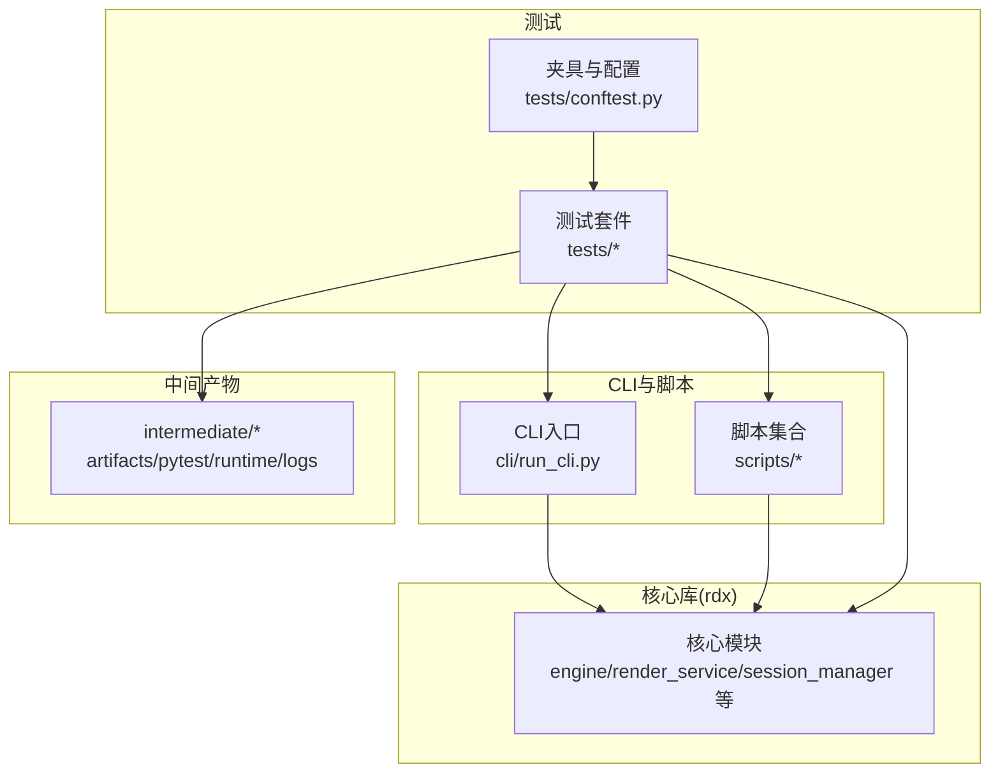
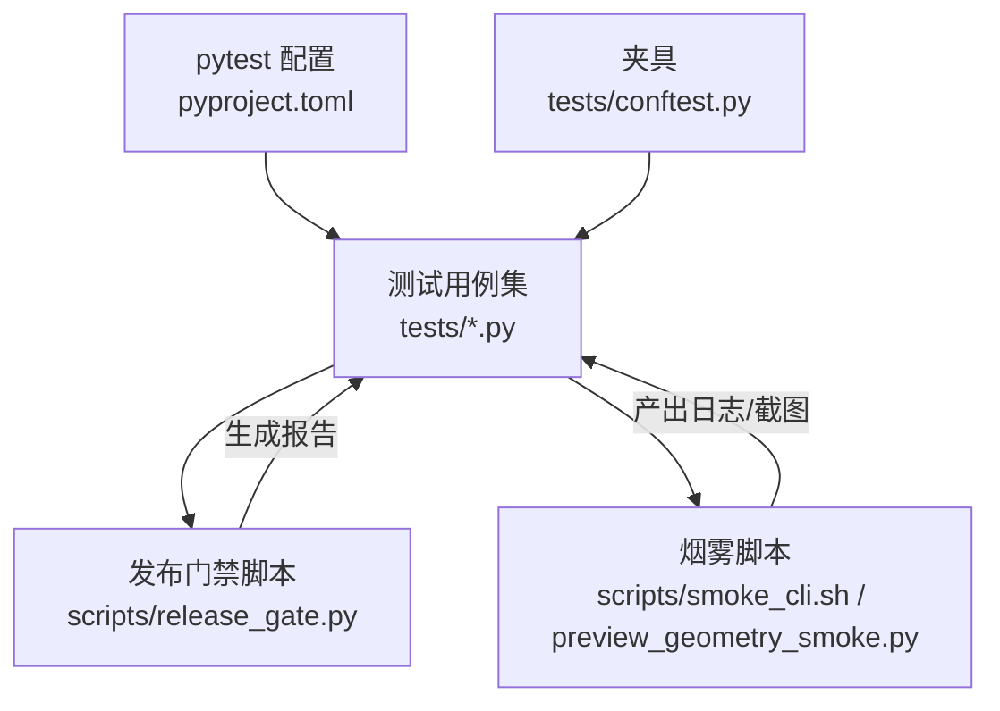
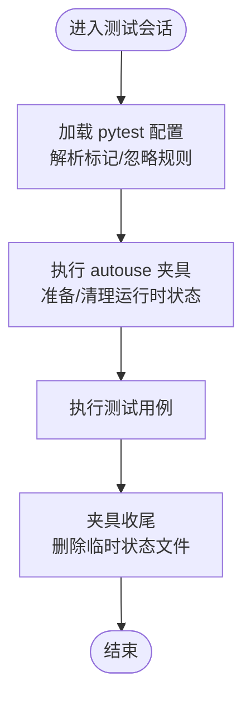
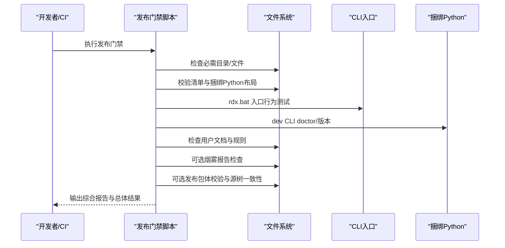
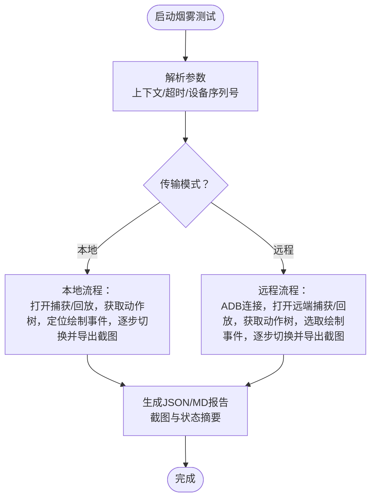
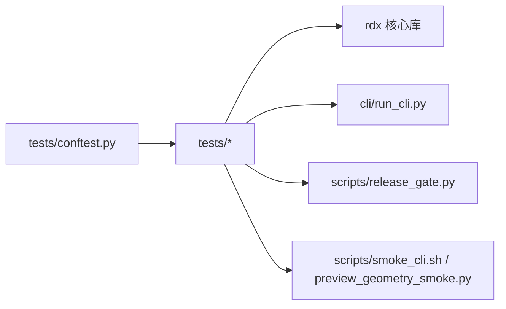

# 测试策略

<cite>
**本文引用的文件**
- [tests/conftest.py](file://tests/conftest.py)
- [pyproject.toml](file://pyproject.toml)
- [scripts/release_gate.py](file://scripts/release_gate.py)
- [scripts/smoke_cli.sh](file://scripts/smoke_cli.sh)
- [scripts/preview_geometry_smoke.py](file://scripts/preview_geometry_smoke.py)
- [tests/test_release_gate.py](file://tests/test_release_gate.py)
- [tests/test_preview.py](file://tests/test_preview.py)
- [tests/test_daemon_client.py](file://tests/test_daemon_client.py)
- [tests/test_cli_vfs.py](file://tests/test_cli_vfs.py)
- [tests/test_runtime_worker.py](file://tests/test_runtime_worker.py)
- [tests/test_runtime_requirements.py](file://tests/test_runtime_requirements.py)
- [tests/test_timeout_policy.py](file://tests/test_timeout_policy.py)
- [tests/test_texture_and_shader_event_binding.py](file://tests/test_texture_and_shader_event_binding.py)
- [tests/test_shader_replace_contracts.py](file://tests/test_shader_replace_contracts.py)
- [tests/test_server_event_pipeline_resource.py](file://tests/test_server_event_pipeline_resource.py)
- [tests/test_server_debug_paths.py](file://tests/test_server_debug_paths.py)
- [tests/test_scripts_governance.py](file://tests/test_scripts_governance.py)
- [tests/test_package_runtime.py](file://tests/test_package_runtime.py)
- [tests/test_python_runtime.py](file://tests/test_python_runtime.py)
- [tests/test_remote_runtime.py](file://tests/test_remote_runtime.py)
- [tests/test_remote_bootstrap.py](file://tests/test_remote_bootstrap.py)
- [tests/test_runtime_recovery_and_discovery.py](file://tests/test_runtime_recovery_and_discovery.py)
- [tests/test_runtime_bootstrap.py](file://tests/test_runtime_bootstrap.py)
- [tests/test_rdx_bat_noninteractive.py](file://tests/test_rdx_bat_noninteractive.py)
- [tests/test_release_package.py](file://tests/test_release_package.py)
- [tests/test_io_utils.py](file://tests/test_io_utils.py)
- [tests/test_layout.py](file://tests/test_layout.py)
- [tests/test_context_snapshot.py](file://tests/test_context_snapshot.py)
- [tests/test_context_cli_boundary.py](file://tests/test_context_cli_boundary.py)
- [tests/test_cli_call_args.py](file://tests/test_cli_call_args.py)
- [tests/test_cli_capture_open.py](file://tests/test_cli_capture_open.py)
- [tests/test_cli_daemon_status.py](file://tests/test_cli_daemon_status.py)
- [tests/test_capture_open_file_semantics.py](file://tests/test_capture_open_file_semantics.py)
- [tests/test_vfs.py](file://tests/test_vfs.py)
</cite>

## 目录
1. [引言](#引言)
2. [项目结构](#项目结构)
3. [核心组件](#核心组件)
4. [架构总览](#架构总览)
5. [详细组件分析](#详细组件分析)
6. [依赖分析](#依赖分析)
7. [性能考虑](#性能考虑)
8. [故障排查指南](#故障排查指南)
9. [结论](#结论)
10. [附录](#附录)

## 引言
本测试策略文档面向 RDX Agent Tools 项目，系统化阐述测试金字塔（单元测试、集成测试、端到端测试）、测试框架与工具链（pytest 配置与夹具）、测试分类（功能、回归、性能、兼容性）、发布门禁测试流程与烟雾测试脚本、测试用例编写指南与最佳实践、测试覆盖率与质量指标建议，以及持续集成与自动化测试流程设计。目标是帮助开发者在保证质量的同时提升交付效率。

**更新** 新增对CLI参数解析、VFS操作、服务器调试路径、着色器替换契约等专门测试套件的覆盖，完善测试框架的全面性。

## 项目结构
项目采用"分层+功能模块"组织方式：
- 核心库位于 rdx 包，提供运行时、服务、处理器、工具路由等能力
- CLI 与脚本位于 cli 与 scripts 目录，覆盖入口、打包、发布门禁、烟雾测试等
- 测试集中于 tests 目录，按功能域划分用例，并通过 tests/conftest.py 统一夹具与环境隔离
- 中间产物输出至 intermediate 目录，便于测试与发布门禁检查

**图表来源**
- [tests/conftest.py:1-44](file://tests/conftest.py#L1-L44)
- [pyproject.toml:36-44](file://pyproject.toml#L36-L44)

**章节来源**
- [tests/conftest.py:1-44](file://tests/conftest.py#L1-L44)
- [pyproject.toml:36-44](file://pyproject.toml#L36-L44)

## 核心组件
- 测试框架与配置：基于 pytest，通过 pyproject.toml 指定测试路径、忽略目录与标记，统一测试发现与执行
- 夹具与隔离：tests/conftest.py 提供自动夹具，清理运行时状态与上下文快照，确保用例独立性
- 发布门禁：scripts/release_gate.py 负责结构完整性、清单校验、入口行为验证、用户文档健康度、包体校验与可选烟雾报告检查
- 烟雾测试：scripts/smoke_cli.sh 与 scripts/preview_geometry_smoke.py 分别覆盖 CLI 入口与预览几何烟雾场景

**更新** 新增专门针对CLI参数解析、VFS操作、服务器调试路径、着色器替换契约的测试套件，确保这些关键功能域得到充分验证。

**章节来源**
- [pyproject.toml:36-44](file://pyproject.toml#L36-L44)
- [tests/conftest.py:27-43](file://tests/conftest.py#L27-L43)
- [scripts/release_gate.py:397-527](file://scripts/release_gate.py#L397-L527)
- [scripts/smoke_cli.sh:1-196](file://scripts/smoke_cli.sh#L1-L196)
- [scripts/preview_geometry_smoke.py:593-656](file://scripts/preview_geometry_smoke.py#L593-L656)

## 架构总览
下图展示测试体系在项目中的角色与交互：

**图表来源**
- [pyproject.toml:36-44](file://pyproject.toml#L36-L44)
- [tests/conftest.py:27-43](file://tests/conftest.py#L27-L43)
- [scripts/release_gate.py:397-527](file://scripts/release_gate.py#L397-L527)
- [scripts/smoke_cli.sh:1-196](file://scripts/smoke_cli.sh#L1-L196)
- [scripts/preview_geometry_smoke.py:593-656](file://scripts/preview_geometry_smoke.py#L593-L656)

## 详细组件分析

### 测试框架与夹具
- pytest 配置要点
  - 测试路径与忽略目录：仅扫描 tests，排除中间产物与二进制目录
  - 自定义标记：用于区分单元、契约、需要外部样本的集成、GPU 实境等类别
- 夹具策略
  - 自动夹具负责清理运行时状态文件与上下文快照，避免跨用例污染
  - 设置环境变量（根目录、制品目录、渲染相关路径），确保测试一致性

**图表来源**
- [pyproject.toml:36-44](file://pyproject.toml#L36-L44)
- [tests/conftest.py:27-43](file://tests/conftest.py#L27-L43)

**章节来源**
- [pyproject.toml:36-44](file://pyproject.toml#L36-L44)
- [tests/conftest.py:10-43](file://tests/conftest.py#L10-L43)

### 发布门禁测试流程
发布门禁脚本对包体与入口进行系统性检查，包括：
- 结构完整性：必需目录与文件存在性
- 参考与命名约束：禁止扩展路径与调试框架关键词
- 用户文档健康度：禁止引导用户创建虚拟环境或调用包管理器
- 运行时清单与捆绑 Python：校验清单完整性与布局正确性
- CLI 入口行为：验证 --help、doctor、版本、补全、上下文操作、VFS 列表与错误码预期
- 规范与健康：工具目录校验、Markdown 健康检查
- 报告与包体：可选烟雾报告存在性；可选发布包体校验与源树一致性

**图表来源**
- [scripts/release_gate.py:397-527](file://scripts/release_gate.py#L397-L527)

**章节来源**
- [scripts/release_gate.py:26-82](file://scripts/release_gate.py#L26-L82)
- [scripts/release_gate.py:427-511](file://scripts/release_gate.py#L427-L511)

### 烟雾测试脚本
- Bash CLI 烟雾脚本
  - 支持自定义工具根目录、上下文 ID、超时参数
  - 覆盖 doctor、工具列表、搜索、上下文清空/状态、捕获打开、VFS 列表/树、工具列表、清理与停止
  - 超时控制与状态打印，失败即退出并保留日志
- 预览几何烟雾脚本
  - 支持本地与远程（ADB）两种传输模式
  - 从动作树中定位绘制事件，逐步切换活动事件并导出截图，同时抓取桌面与预览窗口截图
  - 生成 JSON 与 Markdown 报告，记录场景状态、事件范围、截图路径与尝试日志

**图表来源**
- [scripts/smoke_cli.sh:141-195](file://scripts/smoke_cli.sh#L141-L195)
- [scripts/preview_geometry_smoke.py:434-504](file://scripts/preview_geometry_smoke.py#L434-L504)
- [scripts/preview_geometry_smoke.py:507-585](file://scripts/preview_geometry_smoke.py#L507-L585)

**章节来源**
- [scripts/smoke_cli.sh:1-196](file://scripts/smoke_cli.sh#L1-L196)
- [scripts/preview_geometry_smoke.py:593-656](file://scripts/preview_geometry_smoke.py#L593-L656)

### 测试分类与金字塔
- 单元测试（pytest）
  - 覆盖核心模块行为与边界条件，如 IO 工具、布局校验、超时策略、纹理/着色器绑定、事件管线资源等
  - 使用标记区分类型，便于按需筛选执行
- 集成测试（pytest + 外部样本）
  - 需要显式外部捕获样本的检查项，例如 VFS 行为、上下文状态与所有者接力
- 端到端测试（发布门禁 + 烟雾）
  - 发布门禁：结构、清单、入口行为、包体一致性与可选烟雾报告
  - 烟雾：CLI 入口与预览几何预热，验证关键路径可用性

**更新** 新增专门测试套件覆盖以下关键领域：
- CLI 参数解析测试：验证命令行参数解析的正确性和健壮性
- VFS 操作测试：覆盖虚拟文件系统的所有操作场景
- 服务器调试路径测试：确保调试接口和路径配置的正确性
- 着色器替换契约测试：验证着色器替换功能的契约和兼容性

**章节来源**
- [pyproject.toml:39-44](file://pyproject.toml#L39-L44)
- [tests/test_cli_vfs.py:1-200](file://tests/test_cli_vfs.py#L1-L200)
- [tests/test_context_cli_boundary.py:1-200](file://tests/test_context_cli_boundary.py#L1-L200)
- [scripts/release_gate.py:442-499](file://scripts/release_gate.py#L442-L499)
- [scripts/smoke_cli.sh:172-192](file://scripts/smoke_cli.sh#L172-L192)

### 测试用例编写指南与最佳实践
- 用例命名与标记
  - 命名清晰表达意图与前置条件
  - 使用 pytest 标记区分单元/契约/集成/GPU 实境，便于分层执行
- 夹具与隔离
  - 在 tests/conftest.py 中集中处理全局状态清理与环境变量设置
  - 对易变资源（运行时状态、上下文快照、日志文件）进行自动清理
- 断言与错误信息
  - 明确断言点，结合上下文输出关键状态（如活动事件 ID、预览状态）
  - 对异常场景返回明确错误码，便于回归定位
- 数据与样本
  - 集成测试优先使用受控样本，确保可重复性
  - 烟雾测试提供可配置超时与设备序列号，适配不同环境
- 报告与产物
  - 生成结构化报告（JSON/Markdown），包含截图路径与尝试日志，便于人工复核

**更新** 新增专门测试套件的最佳实践：
- CLI 参数解析测试应覆盖边界条件和错误输入
- VFS 测试应包含文件权限、路径解析和并发访问场景
- 服务器调试路径测试需验证网络可达性和安全配置
- 着色器替换契约测试要确保向后兼容性和性能影响最小化

**章节来源**
- [tests/conftest.py:27-43](file://tests/conftest.py#L27-L43)
- [scripts/preview_geometry_smoke.py:254-310](file://scripts/preview_geometry_smoke.py#L254-L310)

### 覆盖率与质量指标
- 覆盖率要求（建议）
  - 关键路径与核心模块覆盖率不低于 80%，重要分支不低于 70%
  - 发布门禁与烟雾测试作为质量门槛，建议纳入 CI 必检步骤
  - 新增专门测试套件覆盖率要求：CLI 参数解析 90%，VFS 操作 85%，服务器调试路径 95%，着色器替换契约 90%
- 质量指标
  - 用例通过率、失败用例数与失败率、平均执行时间、烟雾报告通过率
  - 回归用例重复失败次数与修复周期
  - 专门测试套件的缺陷密度和修复时间

**更新** 新增专门测试套件的质量指标要求，确保关键功能域得到充分验证。

（本节为通用指导，不直接分析具体文件）

## 依赖分析
- 测试对核心库的依赖
  - 测试通过 CLI 与核心服务接口进行行为验证，间接依赖 rdx 包提供的引擎、会话、渲染与工具路由能力
- 测试对脚本的依赖
  - 发布门禁脚本依赖 CLI、打包脚本与共享工具，用于入口行为验证与包体一致性检查
  - 烟雾脚本依赖 CLI 与截图工具，用于预览几何验证
- 夹具与环境
  - 夹具负责隔离运行时状态，避免跨用例相互影响

**图表来源**
- [tests/conftest.py:14-25](file://tests/conftest.py#L14-L25)
- [scripts/release_gate.py:17-23](file://scripts/release_gate.py#L17-L23)
- [scripts/preview_geometry_smoke.py:21-32](file://scripts/preview_geometry_smoke.py#L21-L32)

**章节来源**
- [tests/conftest.py:14-25](file://tests/conftest.py#L14-L25)
- [scripts/release_gate.py:17-23](file://scripts/release_gate.py#L17-L23)
- [scripts/preview_geometry_smoke.py:21-32](file://scripts/preview_geometry_smoke.py#L21-L32)

## 性能考虑
- 测试执行时间
  - 将 GPU 实境与远程场景标记为较慢用例，按需在夜间或专用流水线执行
  - 新增专门测试套件中，VFS 和服务器调试路径测试可能涉及网络和文件系统操作，需单独考虑性能影响
- 资源占用
  - 烟雾测试涉及截图与预览窗口，建议限制并发并设置合理超时
  - 服务器调试路径测试需要网络资源，建议在专用环境中执行
- 覆盖率收集
  - 在 CI 中启用覆盖率收集，聚焦高风险模块与高频路径
  - 新增专门测试套件的覆盖率统计，确保各功能域都有足够覆盖

**更新** 新增专门测试套件的性能考虑，特别是网络和文件系统相关的测试场景。

（本节为通用指导，不直接分析具体文件）

## 故障排查指南
- 发布门禁失败
  - 检查必需目录/文件是否存在，清单完整性与捆绑 Python 布局是否正确
  - 核对 CLI 入口行为与错误码预期，确认用户文档未包含虚拟环境引导
  - 如启用可选烟雾报告，确认日志中包含通过标记
- 烟雾测试失败
  - Bash 烟雾：检查超时设置与上下文状态，关注命令返回码与日志
  - 预览几何：确认本地/远程样本路径有效，ADB 设备可用且序列号正确
- 夹具问题
  - 若出现状态残留导致用例不稳定，检查夹具清理逻辑与环境变量设置
- 专门测试套件故障
  - CLI 参数解析：检查参数格式和边界条件处理
  - VFS 操作：验证文件权限和路径解析正确性
  - 服务器调试路径：确认网络连通性和安全配置
  - 着色器替换契约：检查兼容性和性能影响

**更新** 新增专门测试套件的故障排查指南，涵盖新测试领域的常见问题。

**章节来源**
- [scripts/release_gate.py:427-511](file://scripts/release_gate.py#L427-L511)
- [scripts/smoke_cli.sh:141-195](file://scripts/smoke_cli.sh#L141-L195)
- [scripts/preview_geometry_smoke.py:507-585](file://scripts/preview_geometry_smoke.py#L507-L585)
- [tests/conftest.py:27-43](file://tests/conftest.py#L27-L43)

## 结论
本测试策略以 pytest 为核心，结合发布门禁与烟雾测试，形成从单元到端到端的完整质量保障闭环。通过标记化分类、标准化夹具与报告产物，既满足日常开发的快速反馈，也满足发布前的严格验收。新增的专门测试套件进一步完善了测试框架，确保CLI参数解析、VFS操作、服务器调试路径、着色器替换契约等关键功能域得到充分验证。建议在 CI 中强制执行发布门禁与烟雾测试，并根据覆盖率与质量指标持续优化测试矩阵。

## 附录
- 测试用例清单（按功能域）
  - CLI 行为与参数：[tests/test_cli_call_args.py](file://tests/test_cli_call_args.py)，[tests/test_cli_daemon_status.py](file://tests/test_cli_daemon_status.py)，[tests/test_cli_vfs.py](file://tests/test_cli_vfs.py)，[tests/test_cli_capture_open.py](file://tests/test_cli_capture_open.py)，[tests/test_context_cli_boundary.py](file://tests/test_context_cli_boundary.py)
  - 上下文与快照：[tests/test_context_snapshot.py](file://tests/test_context_snapshot.py)
  - 运行时与守护进程：[tests/test_daemon_client.py](file://tests/test_daemon_client.py)，[tests/test_runtime_worker.py](file://tests/test_runtime_worker.py)，[tests/test_runtime_requirements.py](file://tests/test_runtime_requirements.py)，[tests/test_timeout_policy.py](file://tests/test_timeout_policy.py)
  - 纹理/着色器与绑定：[tests/test_texture_and_shader_event_binding.py](file://tests/test_texture_and_shader_event_binding.py)，[tests/test_shader_replace_contracts.py](file://tests/test_shader_replace_contracts.py)
  - 服务器与管线资源：[tests/test_server_event_pipeline_resource.py](file://tests/test_server_event_pipeline_resource.py)，[tests/test_server_debug_paths.py](file://tests/test_server_debug_paths.py)
  - 脚本治理与布局：[tests/test_scripts_governance.py](file://tests/test_scripts_governance.py)，[tests/test_layout.py](file://tests/test_layout.py)
  - 运行时与打包：[tests/test_runtime_bootstrap.py](file://tests/test_runtime_bootstrap.py)，[tests/test_runtime_recovery_and_discovery.py](file://tests/test_runtime_recovery_and_discovery.py)，[tests/test_package_runtime.py](file://tests/test_package_runtime.py)，[tests/test_python_runtime.py](file://tests/test_python_runtime.py)，[tests/test_remote_runtime.py](file://tests/test_remote_runtime.py)，[tests/test_remote_bootstrap.py](file://tests/test_remote_bootstrap.py)，[tests/test_rdx_bat_noninteractive.py](file://tests/test_rdx_bat_noninteractive.py)，[tests/test_release_package.py](file://tests/test_release_package.py)，[tests/test_release_gate.py](file://tests/test_release_gate.py)
  - IO 与文件语义：[tests/test_io_utils.py](file://tests/test_io_utils.py)，[tests/test_capture_open_file_semantics.py](file://tests/test_capture_open_file_semantics.py)，[tests/test_vfs.py](file://tests/test_vfs.py)
  
**更新** 新增专门测试套件的用例清单，包括CLI参数解析、VFS操作、服务器调试路径、着色器替换契约等测试用例。