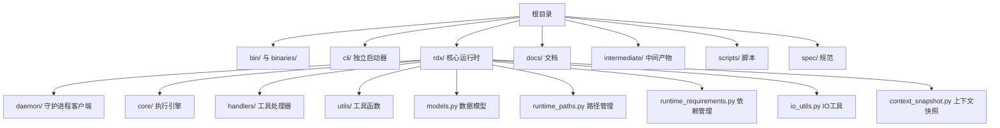
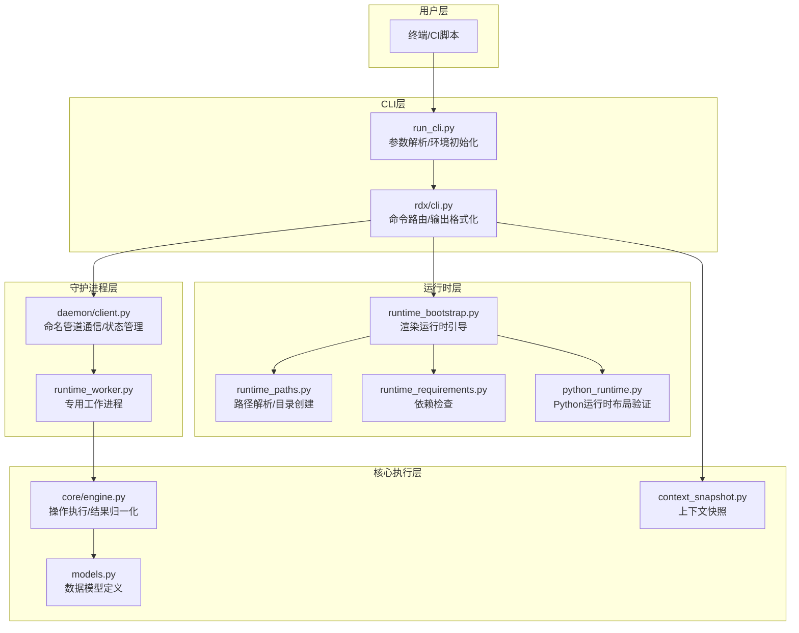
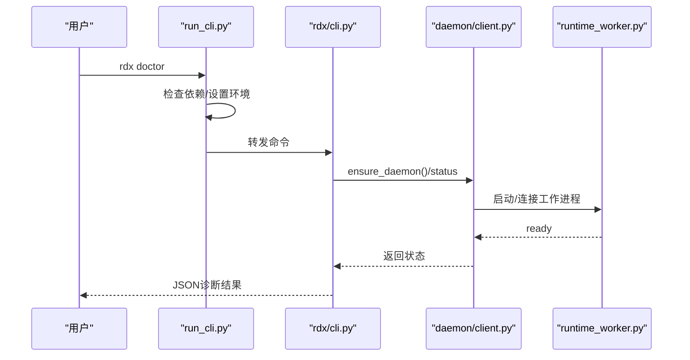
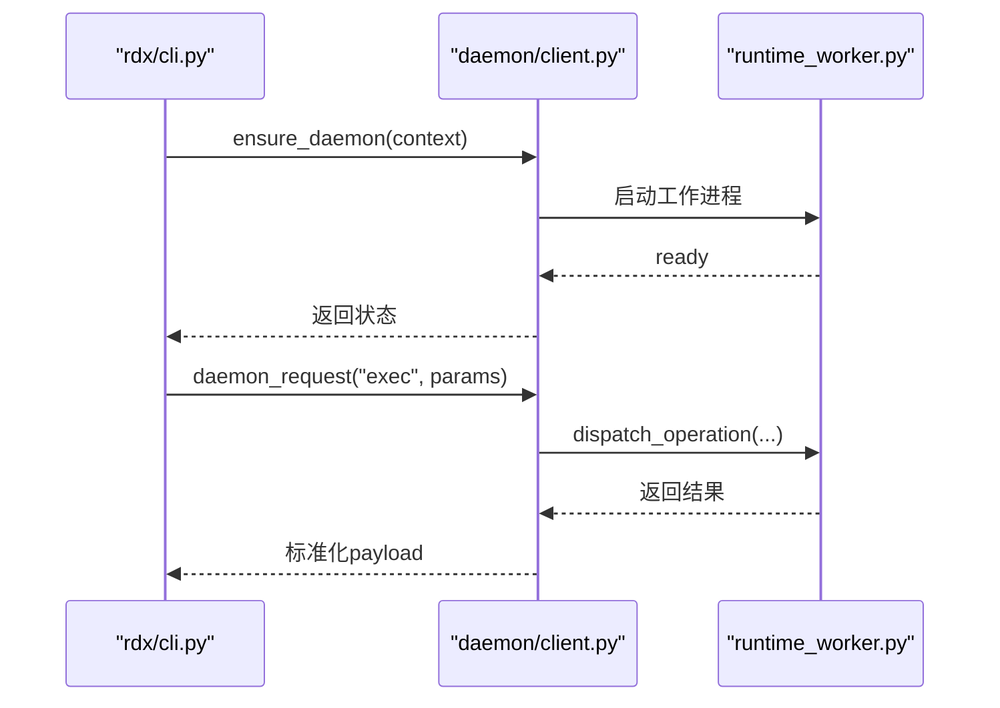
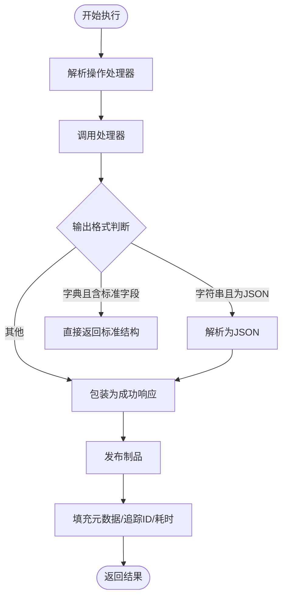
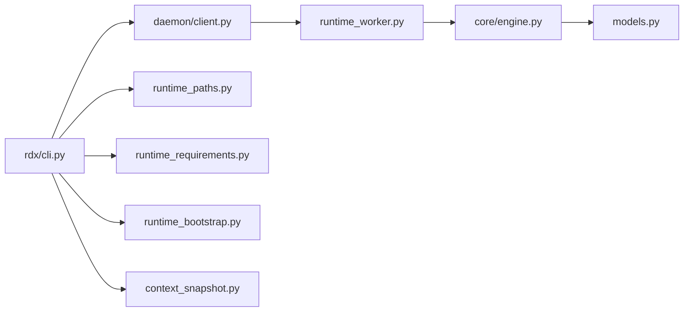

# rdx原生代理工作手册

<cite>
**本文档引用的文件**
- [README.md](file://README.md)
- [docs/README.md](file://docs/README.md)
- [rdx/__init__.py](file://rdx/__init__.py)
- [cli/run_cli.py](file://cli/run_cli.py)
- [rdx/cli.py](file://rdx/cli.py)
- [rdx/runtime_bootstrap.py](file://rdx/runtime_bootstrap.py)
- [rdx/daemon/client.py](file://rdx/daemon/client.py)
- [rdx/runtime_paths.py](file://rdx/runtime_paths.py)
- [rdx/runtime_requirements.py](file://rdx/runtime_requirements.py)
- [rdx/io_utils.py](file://rdx/io_utils.py)
- [rdx/core/engine.py](file://rdx/core/engine.py)
- [rdx/runtime_worker.py](file://rdx/runtime_worker.py)
- [rdx/python_runtime.py](file://rdx/python_runtime.py)
- [rdx/models.py](file://rdx/models.py)
- [rdx/context_snapshot.py](file://rdx/context_snapshot.py)
</cite>

## 目录
1. [简介](#简介)
2. [项目结构](#项目结构)
3. [核心组件](#核心组件)
4. [架构总览](#架构总览)
5. [详细组件分析](#详细组件分析)
6. [依赖关系分析](#依赖关系分析)
7. [性能考虑](#性能考虑)
8. [故障排除指南](#故障排除指南)
9. [结论](#结论)
10. [附录](#附录)

## 简介
本工作手册面向使用 rdx 原生代理工具的工程师与自动化系统，提供从安装、配置到日常运维与故障排除的完整操作指南。rdx 是一个仅基于命令行的 RenderDoc .rdc 运行时包，支持 Windows x64 本地回放以及远程 Android 回放，通过 194 个以 JSON 为主的 `rd.*` 工具命令提供统一的调试与分析能力。

- 支持平台：Windows x64（本地）、Android（远程）
- 入口方式：命令行工具 rdx 或直接调用 Python 启动脚本
- 核心特性：上下文状态管理、预览会话、工具目录、守护进程通信、渲染管线分析、着色器导出与断言等

## 项目结构
仓库采用按功能域划分的模块化组织方式，核心目录与职责如下：

- bin/ 与 binaries/：包含 Windows x64 平台的运行时二进制与 Python 运行时
- cli/：独立的 CLI 启动器，负责环境初始化、依赖检查与命令路由
- rdx/：核心运行时与工具实现，包括守护进程客户端、执行引擎、路径与依赖管理、数据模型等
- docs/：官方文档索引与各专题说明
- intermediate/：中间产物目录，包含日志、工件、pytest 输出等
- scripts/：发布与测试脚本集合
- spec/：工具目录规范与校验

**图表来源**
- [README.md:1-68](file://README.md#L1-L68)
- [docs/README.md:1-23](file://docs/README.md#L1-L23)

**章节来源**
- [README.md:1-68](file://README.md#L1-L68)
- [docs/README.md:1-23](file://docs/README.md#L1-L23)

## 核心组件
- CLI 启动器与入口
  - 独立启动器负责解析参数、设置环境变量、检查依赖、引导运行时并转发到 rdx.cli 主程序
  - 提供版本查询、诊断、工具列表、上下文管理、守护进程控制、VFS、事件与管线分析、资源导出等命令
- 守护进程客户端
  - 通过命名管道与守护进程通信，支持启动、状态查询、心跳、客户端挂接/离线、清理过期状态等
- 执行引擎
  - 统一处理工具操作的执行、结果规范化、错误映射与制品发布
- 路径与依赖管理
  - 解析工具根目录、运行时目录、Python 运行时布局，检查必需依赖
- 数据模型
  - 定义会话、捕获、事件树、异常、补丁、实验、报告等结构化数据类型
- 上下文快照
  - 管理每个上下文的会话状态、焦点信息、预览显示参数、最近工件等

**章节来源**
- [cli/run_cli.py:1-291](file://cli/run_cli.py#L1-L291)
- [rdx/cli.py:1-800](file://rdx/cli.py#L1-L800)
- [rdx/daemon/client.py:1-833](file://rdx/daemon/client.py#L1-L833)
- [rdx/core/engine.py:1-204](file://rdx/core/engine.py#L1-L204)
- [rdx/runtime_paths.py:1-122](file://rdx/runtime_paths.py#L1-L122)
- [rdx/runtime_requirements.py:1-73](file://rdx/runtime_requirements.py#L1-L73)
- [rdx/models.py:1-562](file://rdx/models.py#L1-L562)
- [rdx/context_snapshot.py:1-541](file://rdx/context_snapshot.py#L1-L541)

## 架构总览
rdx 的整体架构由“CLI 启动器 → 守护进程 → 执行引擎”三层组成，配合上下文状态与制品发布机制，形成可扩展的工具链。

**图表来源**
- [cli/run_cli.py:1-291](file://cli/run_cli.py#L1-L291)
- [rdx/cli.py:1-800](file://rdx/cli.py#L1-L800)
- [rdx/runtime_bootstrap.py:1-131](file://rdx/runtime_bootstrap.py#L1-L131)
- [rdx/runtime_paths.py:1-122](file://rdx/runtime_paths.py#L1-L122)
- [rdx/runtime_requirements.py:1-73](file://rdx/runtime_requirements.py#L1-L73)
- [rdx/python_runtime.py:1-172](file://rdx/python_runtime.py#L1-L172)
- [rdx/daemon/client.py:1-833](file://rdx/daemon/client.py#L1-L833)
- [rdx/runtime_worker.py:1-119](file://rdx/runtime_worker.py#L1-L119)
- [rdx/core/engine.py:1-204](file://rdx/core/engine.py#L1-L204)
- [rdx/models.py:1-562](file://rdx/models.py#L1-L562)
- [rdx/context_snapshot.py:1-541](file://rdx/context_snapshot.py#L1-L541)

## 详细组件分析

### CLI 启动器与主程序
- run_cli.py
  - 初始化工具根目录与运行时目录，注入环境变量，检查缺失依赖；在 doctor 命令中可快速返回诊断结果
  - 引导渲染运行时，加载 rdx.cli 并执行命令
- rdx/cli.py
  - 定义完整的命令集：版本、诊断、工具列表/搜索、守护进程、上下文、会话预览、VFS、事件与管线、资源、导出、像素分析、断言与差异等
  - 实现 TSV 投影渲染、JSON 结果输出、超时策略、Windows 命令行参数提取等
  - 通过 daemon_request 将操作转发给守护进程，并对结果进行标准化封装

**图表来源**
- [cli/run_cli.py:226-283](file://cli/run_cli.py#L226-L283)
- [rdx/cli.py:407-530](file://rdx/cli.py#L407-L530)
- [rdx/daemon/client.py:576-674](file://rdx/daemon/client.py#L576-L674)
- [rdx/runtime_worker.py:30-52](file://rdx/runtime_worker.py#L30-L52)

**章节来源**
- [cli/run_cli.py:1-291](file://cli/run_cli.py#L1-L291)
- [rdx/cli.py:1-800](file://rdx/cli.py#L1-L800)

### 守护进程客户端与工作进程
- daemon/client.py
  - 管理守护进程状态文件、命名管道地址、令牌与进程生命周期
  - 提供 ensure_daemon、daemon_request、attach_client、heartbeat_client、clear_context 等接口
  - 支持清理过期状态、检测僵尸进程、回收孤儿上下文文件
- runtime_worker.py
  - 专用工作进程，接收来自守护进程的请求，执行操作并返回结果
  - 支持 exec、clear_context、status、shutdown 等方法

**图表来源**
- [rdx/daemon/client.py:420-468](file://rdx/daemon/client.py#L420-L468)
- [rdx/runtime_worker.py:68-114](file://rdx/runtime_worker.py#L68-L114)

**章节来源**
- [rdx/daemon/client.py:1-833](file://rdx/daemon/client.py#L1-L833)
- [rdx/runtime_worker.py:1-119](file://rdx/runtime_worker.py#L1-L119)

### 执行引擎与结果归一化
- core/engine.py
  - 统一执行入口，解析操作名与参数，调用注册表中的处理器
  - 对原始输出进行归一化，确保返回标准的 JSON 包装结构（包含 ok、result_kind、data、artifacts、error、meta、projections 等字段）
  - 处理异常映射、追踪 ID、传输信息与耗时统计

**图表来源**
- [rdx/core/engine.py:40-204](file://rdx/core/engine.py#L40-L204)

**章节来源**
- [rdx/core/engine.py:1-204](file://rdx/core/engine.py#L1-L204)

### 路径与依赖管理
- runtime_paths.py
  - 解析工具根目录、运行时根目录、CLI 运行时目录、工件目录、日志目录等
  - 提供 ensure_runtime_dirs 创建必要目录
- runtime_requirements.py
  - 定义必需依赖（如 pydantic、numpy、Pillow、Jinja2、aiofiles），并提供缺失依赖检测
- runtime_bootstrap.py
  - 设置 RDX_RUNTIME_DLL_DIR 与 RDX_RENDERDOC_PATH，向 sys.path 注入模块路径，注册 DLL 目录，探测渲染运行时导入
- python_runtime.py
  - 读取运行时清单，解析捆绑 Python 的布局，验证路径完整性与标准库存在性

**章节来源**
- [rdx/runtime_paths.py:1-122](file://rdx/runtime_paths.py#L1-L122)
- [rdx/runtime_requirements.py:1-73](file://rdx/runtime_requirements.py#L1-L73)
- [rdx/runtime_bootstrap.py:1-131](file://rdx/runtime_bootstrap.py#L1-L131)
- [rdx/python_runtime.py:1-172](file://rdx/python_runtime.py#L1-L172)

### 数据模型与上下文快照
- models.py
  - 定义后端类型、图形 API、着色器阶段、异常类型、验证器类型、补丁类型、实验状态、结论结果、二分策略等枚举
  - 定义会话、捕获、事件树、异常、假设、管线快照、着色器导出包、补丁规范与结果、实验证据与结果、二分结果、性能计数器、报告包、指纹记录、回归条目等结构化模型
- context_snapshot.py
  - 管理上下文快照文件，支持并发锁、原子写入、保留策略（总数限制、按类型限制）
  - 规范化预览显示状态、像素焦点、资源/着色器 ID、最近工件列表等

**章节来源**
- [rdx/models.py:1-562](file://rdx/models.py#L1-L562)
- [rdx/context_snapshot.py:1-541](file://rdx/context_snapshot.py#L1-L541)

## 依赖关系分析
- 组件耦合
  - CLI 层依赖守护进程客户端与路径/依赖管理模块
  - 守护进程客户端依赖工作进程与运行时状态文件
  - 执行引擎依赖操作注册表与制品发布器
  - 上下文快照与 IO 工具共同支撑状态持久化
- 外部依赖
  - Python 运行时（捆绑或系统）
  - 渲染运行时（renderdoc.dll/pyd）
  - 可选工具（spirv-as/dis）

**图表来源**
- [rdx/cli.py:1-800](file://rdx/cli.py#L1-L800)
- [rdx/daemon/client.py:1-833](file://rdx/daemon/client.py#L1-L833)
- [rdx/runtime_worker.py:1-119](file://rdx/runtime_worker.py#L1-L119)
- [rdx/runtime_paths.py:1-122](file://rdx/runtime_paths.py#L1-L122)
- [rdx/runtime_requirements.py:1-73](file://rdx/runtime_requirements.py#L1-L73)
- [rdx/runtime_bootstrap.py:1-131](file://rdx/runtime_bootstrap.py#L1-L131)
- [rdx/context_snapshot.py:1-541](file://rdx/context_snapshot.py#L1-L541)
- [rdx/core/engine.py:1-204](file://rdx/core/engine.py#L1-L204)
- [rdx/models.py:1-562](file://rdx/models.py#L1-L562)

**章节来源**
- [rdx/cli.py:1-800](file://rdx/cli.py#L1-L800)
- [rdx/daemon/client.py:1-833](file://rdx/daemon/client.py#L1-L833)

## 性能考虑
- 命令行参数解析与 JSON 序列化
  - 使用安全的 JSON 写入与流式输出，避免编码问题导致的重试与失败
- 守护进程通信
  - 通过命名管道进行低开销通信；合理设置超时与轮询间隔，避免长时间阻塞
- 结果投影
  - TSV 投影需确保工具返回正确的列与行结构，否则会触发验证错误并提示回退到 JSON
- 文件写入
  - 使用原子写入与备份恢复机制，减少竞态条件与部分写入风险

[本节为通用指导，无需特定文件分析]

## 故障排除指南
- 依赖缺失
  - 使用 doctor 命令查看缺失依赖列表；根据提示安装或修复
- 渲染运行时布局问题
  - 检查 renderdoc.dll、renderdoc.json、renderdoc.pyd 是否存在；验证捆绑 Python 布局是否完整
- 守护进程未就绪
  - 查看状态文件与管道名称；必要时清理过期状态并重新启动
- 命令超时
  - 检查 active_request_count 与 active_operation；根据恢复提示清理上下文后重试
- 输出格式错误
  - 当请求 TSV 投影但工具未返回投影时，会收到验证错误；改用 JSON 或确认工具支持该投影

**章节来源**
- [rdx/cli.py:407-530](file://rdx/cli.py#L407-L530)
- [rdx/daemon/client.py:420-468](file://rdx/daemon/client.py#L420-L468)
- [rdx/io_utils.py:1-161](file://rdx/io_utils.py#L1-L161)

## 结论
rdx 原生代理通过清晰的分层设计与严格的运行时管理，为 RenderDoc 分析提供了稳定可靠的 CLI 工具链。结合上下文状态与守护进程机制，可在本地与远程场景下高效完成捕获分析、管线调试与资源导出等任务。建议在 CI 环境中优先使用 doctor 命令进行自检，并遵循上下文隔离与预览会话的最佳实践。

[本节为总结性内容，无需特定文件分析]

## 附录
- 常用命令速查
  - 版本与诊断：`rdx --version`、`rdx version --json`、`rdx --json doctor`
  - 工具目录：`rdx tools list --json`、`rdx tools search <query> --json`
  - 守护进程：`rdx daemon start|stop|status --daemon-context <id>`
  - 上下文：`rdx context status|update|list|clear --daemon-context <id>`
  - 预览：`rdx session preview on|off|status`
  - VFS：`rdx vfs ls --path / --format tsv`
  - 事件与管线：`rdx event list --format tsv`、`rdx pipeline show --event-id <id>`
  - 资源导出：`rdx export screenshot|texture|buffer|mesh ...`
  - 断言与差异：`rdx assert pipeline|image ...`、`rdx diff pipeline|image ...`

**章节来源**
- [README.md:7-26](file://README.md#L7-L26)
- [rdx/cli.py:62-104](file://rdx/cli.py#L62-L104)