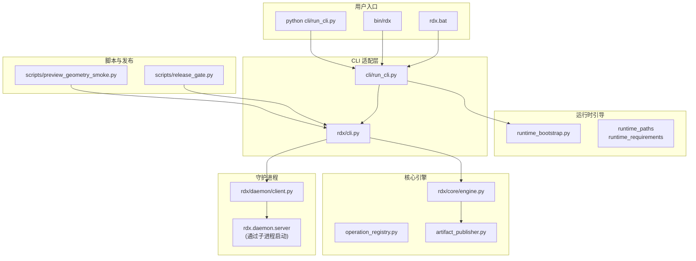
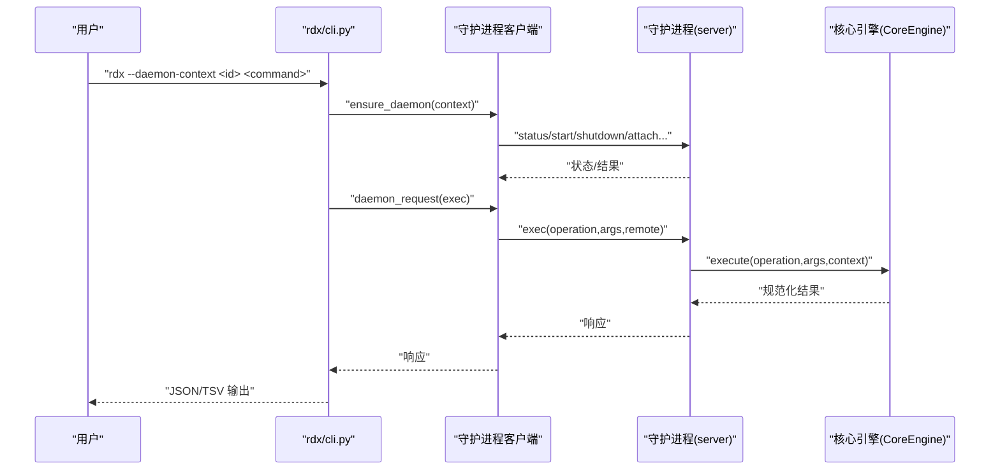
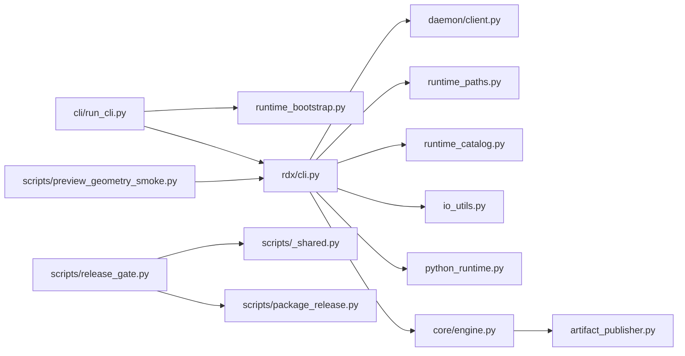

# 最佳实践

<cite>
**本文引用的文件**
- [README.md](file://README.md)
- [docs/README.md](file://docs/README.md)
- [docs/install.md](file://docs/install.md)
- [docs/quickstart.md](file://docs/quickstart.md)
- [docs/agent-integration.md](file://docs/agent-integration.md)
- [docs/configuration.md](file://docs/configuration.md)
- [pyproject.toml](file://pyproject.toml)
- [rdx/__init__.py](file://rdx/__init__.py)
- [cli/run_cli.py](file://cli/run_cli.py)
- [rdx/cli.py](file://rdx/cli.py)
- [rdx/core/engine.py](file://rdx/core/engine.py)
- [rdx/daemon/client.py](file://rdx/daemon/client.py)
- [rdx/runtime_bootstrap.py](file://rdx/runtime_bootstrap.py)
- [scripts/release_gate.py](file://scripts/release_gate.py)
- [scripts/preview_geometry_smoke.py](file://scripts/preview_geometry_smoke.py)
</cite>

## 目录
1. [简介](#简介)
2. [项目结构](#项目结构)
3. [核心组件](#核心组件)
4. [架构总览](#架构总览)
5. [详细组件分析](#详细组件分析)
6. [依赖关系分析](#依赖关系分析)
7. [性能考虑](#性能考虑)
8. [故障排查指南](#故障排查指南)
9. [结论](#结论)
10. [附录](#附录)

## 简介
本指南基于 RDC-Agent-Tools 的实际项目经验，总结团队在使用 rdx-tools 过程中的最佳实践，覆盖工作流建议、性能优化、自动化集成与团队协作方法；提供可落地的使用案例、配置要点与故障预防策略，并明确兼容性、版本管理与升级路径，以及 CI/CD 集成、测试策略与质量保障方法。

## 项目结构
RDC-Agent-Tools 是一个仅通过命令行使用的 RenderDoc 运行时工具包，提供 196 个 rd.* 工具并通过多入口调用：Windows 批处理脚本、POSIX 可执行文件与 Python CLI 启动器。其核心由运行时引导、守护进程客户端、统一执行引擎与脚本化发布门禁组成。

图示来源
- [cli/run_cli.py:1-290](file://cli/run_cli.py#L1-L290)
- [rdx/cli.py:1-800](file://rdx/cli.py#L1-L800)
- [rdx/daemon/client.py:1-833](file://rdx/daemon/client.py#L1-L833)
- [rdx/core/engine.py:1-204](file://rdx/core/engine.py#L1-L204)
- [rdx/runtime_bootstrap.py:1-131](file://rdx/runtime_bootstrap.py#L1-L131)
- [scripts/release_gate.py:1-532](file://scripts/release_gate.py#L1-L532)
- [scripts/preview_geometry_smoke.py:1-666](file://scripts/preview_geometry_smoke.py#L1-L666)

章节来源
- [README.md:1-58](file://README.md#L1-L58)
- [docs/README.md:1-19](file://docs/README.md#L1-L19)

## 核心组件
- 运行时引导与环境准备：负责设置 RDX_RUNTIME_DLL_DIR、RDX_RENDERDOC_PATH，向 PATH 和 sys.path 注入目录，注册 DLL 加载路径，探测 renderdoc.pyd 可导入性。
- 守护进程客户端：通过命名管道与守护进程通信，支持启动/停止/状态查询、客户端挂接/心跳/解绑、上下文清理与过期状态回收。
- 统一执行引擎：标准化操作返回格式，自动收集制品、投影与追踪信息，捕获异常并映射为规范错误载荷。
- CLI 适配层：解析参数、构造请求、处理 TSV 投影渲染、输出 JSON 规范载荷，封装 doctor、tools、context、capture、vfs、diff/assert 等命令。
- 发布门禁与烟雾测试：验证打包完整性、清单一致性、用户文档合规、入口可用性、TSV 投影契约、会话必需条件等；提供预览几何烟雾测试脚本。

章节来源
- [rdx/runtime_bootstrap.py:1-131](file://rdx/runtime_bootstrap.py#L1-L131)
- [rdx/daemon/client.py:1-833](file://rdx/daemon/client.py#L1-L833)
- [rdx/core/engine.py:1-204](file://rdx/core/engine.py#L1-L204)
- [rdx/cli.py:1-800](file://rdx/cli.py#L1-L800)
- [scripts/release_gate.py:1-532](file://scripts/release_gate.py#L1-L532)
- [scripts/preview_geometry_smoke.py:1-666](file://scripts/preview_geometry_smoke.py#L1-L666)

## 架构总览
RDX 采用“CLI 适配层 + 守护进程 + 统一执行引擎”的分层设计。CLI 将用户命令转换为操作名与参数，经守护进程转发到核心引擎执行；引擎规范化输出并产出制品与投影；客户端负责守护进程生命周期与状态持久化。

图示来源
- [rdx/cli.py:226-248](file://rdx/cli.py#L226-L248)
- [rdx/daemon/client.py:420-469](file://rdx/daemon/client.py#L420-L469)
- [rdx/core/engine.py:40-76](file://rdx/core/engine.py#L40-L76)

## 详细组件分析

### CLI 启动与诊断（run_cli.py）
- 入口职责：初始化工具根目录、Python 路径、运行时目录；检查缺失依赖；引导渲染文档运行时；转交到 rdx.cli 主程序。
- 诊断能力：doctor 命令输出 Python 布局、渲染文档二进制/模块、工具目录、入口文件存在性、守护进程状态等。
- 错误处理：对缺少依赖、启动失败、运行时异常进行结构化错误输出，便于自动化捕获。

章节来源
- [cli/run_cli.py:1-290](file://cli/run_cli.py#L1-L290)
- [rdx/cli.py:393-516](file://rdx/cli.py#L393-L516)

### CLI 命令适配（rdx/cli.py）
- 命令体系：version、doctor、tools list/search、daemon start/stop/status、context status/update/list/clear、session preview on/off/status、completion、call、capture open/status、vfs ls/cat/tree/resolve、diff/assert。
- 参数解析与校验：支持 --args-json/--args-file，TSV 投影渲染，格式化输出；对会话必需场景给出恢复提示。
- 守护进程交互：封装 ensure_daemon、daemon_request、状态查询与清理；超时抛出带诊断细节的异常载荷。

章节来源
- [rdx/cli.py:62-95](file://rdx/cli.py#L62-L95)
- [rdx/cli.py:226-292](file://rdx/cli.py#L226-L292)
- [rdx/cli.py:313-378](file://rdx/cli.py#L313-L378)

### 守护进程客户端（rdx/daemon/client.py）
- 生命周期管理：启动/停止/状态、客户端挂接/心跳/解绑、上下文清理、过期状态回收。
- 通信协议：命名管道传输，令牌鉴权；超时控制与重试策略；状态快照与诊断信息。
- 稳定性保障：进程存活检测、租约与空闲超时、强制终止与清理。

章节来源
- [rdx/daemon/client.py:576-675](file://rdx/daemon/client.py#L576-L675)
- [rdx/daemon/client.py:420-469](file://rdx/daemon/client.py#L420-L469)
- [rdx/daemon/client.py:507-559](file://rdx/daemon/client.py#L507-L559)

### 统一执行引擎（rdx/core/engine.py）
- 输出规范化：统一 schema 版本、工具版本、result_kind、ok、data、artifacts、error、meta、projections。
- 制品发布：根据候选收集器发布制品，支持远程模式。
- 性能与可观测：注入 trace_id、transport、duration_ms，便于端到端追踪。

章节来源
- [rdx/core/engine.py:40-76](file://rdx/core/engine.py#L40-L76)
- [rdx/core/engine.py:193-204](file://rdx/core/engine.py#L193-L204)

### 运行时引导（rdx/runtime_bootstrap.py）
- 环境准备：解析 RDX_RUNTIME_DLL_DIR/RDX_RENDERDOC_PATH，注入 sys.path 与 PATH，注册 DLL 目录。
- 导入探测：可选探测 renderdoc.pyd 是否可导入，辅助诊断。

章节来源
- [rdx/runtime_bootstrap.py:105-131](file://rdx/runtime_bootstrap.py#L105-L131)

### 发布门禁（scripts/release_gate.py）
- 结构与清单：检查必需目录/文件、清单完整性与哈希校验、打包与源树一致性。
- 入口可用性：验证 rdx.bat、Python CLI、doctor、tools、context、vfs、diff/assert 等命令。
- 负面用例：TSV 投影缺失、无会话场景下的错误码校验。
- 报告生成：输出 Markdown 报告，汇总通过/失败项。

章节来源
- [scripts/release_gate.py:26-47](file://scripts/release_gate.py#L26-L47)
- [scripts/release_gate.py:228-258](file://scripts/release_gate.py#L228-L258)
- [scripts/release_gate.py:397-528](file://scripts/release_gate.py#L397-L528)

### 预览几何烟雾测试（scripts/preview_geometry_smoke.py）
- 流程：本地/远程两种场景，打开捕获、获取动作树、选择绘制事件、逐步切换活动事件、截图导出、桌面与预览窗口截图、生成报告。
- 诊断：记录预览状态、运行时上下文、截图路径与尝试日志，定位预览不生效问题。
- 复杂度：事件树扁平化、深度搜索、优先选择有帧缓冲输出的绘制事件，具备回退策略。

章节来源
- [scripts/preview_geometry_smoke.py:434-505](file://scripts/preview_geometry_smoke.py#L434-L505)
- [scripts/preview_geometry_smoke.py:507-586](file://scripts/preview_geometry_smoke.py#L507-L586)
- [scripts/preview_geometry_smoke.py:374-432](file://scripts/preview_geometry_smoke.py#L374-L432)

## 依赖关系分析
- 入口依赖：run_cli.py 依赖 runtime_bootstrap、runtime_paths、runtime_requirements；随后引导 rdx.cli。
- CLI 依赖：rdx/cli.py 依赖 daemon.client、runtime_paths、runtime_catalog、timeout_policy、io_utils、python_runtime。
- 引擎依赖：core.engine 依赖 operation_registry、artifact_publisher、contracts、errors、progress。
- 发布门禁：依赖 scripts._shared、package_release、validate_catalog、check_markdown_health。
- 烟雾测试：依赖 PIL、subprocess、argparse、json、time、ctypes 等。

图示来源
- [cli/run_cli.py:255-260](file://cli/run_cli.py#L255-L260)
- [rdx/cli.py:17-46](file://rdx/cli.py#L17-L46)
- [rdx/core/engine.py:12-18](file://rdx/core/engine.py#L12-L18)
- [scripts/release_gate.py:21-23](file://scripts/release_gate.py#L21-L23)
- [scripts/preview_geometry_smoke.py:1-12](file://scripts/preview_geometry_smoke.py#L1-L12)

章节来源
- [pyproject.toml:1-45](file://pyproject.toml#L1-L45)

## 性能考虑
- 守护进程超时与重试：合理设置租约与空闲超时，避免长时间占用资源；对超时错误携带诊断字段，便于快速定位。
- TSV 投影按需启用：仅在列表/导航类命令使用 TSV，复杂嵌套状态仍以 JSON 为准，减少不必要的投影开销。
- 截图与预览：批量导出截图前优先选择有帧缓冲输出的绘制事件，降低失败重试成本。
- 运行时引导：仅在必要时注册 DLL 目录与注入 PATH，避免重复操作带来的额外开销。

## 故障排查指南
- doctor 诊断：检查 Python 布局、渲染文档二进制/模块、工具目录、入口文件存在性、守护进程状态；关注缺失依赖与布局失败项。
- 守护进程超时：查看 active_operation、daemon_state_excerpt、active_request_count 等诊断字段，按提示清理上下文或关闭会话后重试。
- TSV 投影缺失：确认命令是否支持该投影，否则改用 JSON 输出；遵循“列表/导航用 TSV，嵌套状态用 JSON”原则。
- 无会话错误：在需要会话的命令前先打开捕获或显式传入会话 ID；使用 context clear 与 daemon stop 清理残留状态。
- 发布门禁失败：对照报告逐项修复，重点关注清单完整性、打包一致性、入口可用性与用户文档合规。

章节来源
- [rdx/cli.py:393-516](file://rdx/cli.py#L393-L516)
- [rdx/daemon/client.py:420-469](file://rdx/daemon/client.py#L420-L469)
- [scripts/release_gate.py:470-493](file://scripts/release_gate.py#L470-L493)

## 结论
RDC-Agent-Tools 提供了稳定、可扩展且易于集成的命令行调试工具集。通过规范化的 CLI 协议、守护进程驱动与统一执行引擎，团队可在本地与远程设备上一致地开展捕获分析、管线对比与预览验证。结合发布门禁与烟雾测试脚本，可有效保障交付质量与回归稳定性。

## 附录

### 工作流建议
- 任务隔离：使用 --daemon-context 为每个任务分配独立上下文，避免状态串扰。
- 诊断先行：每次运行前执行 doctor 与 tools list，确保环境就绪。
- 会话管理：打开捕获后及时更新 context notes，结束时清理上下文并停止守护进程。
- 预览验证：开启预览后检查 preview.display 字段，避免仅凭截图推断几何。

章节来源
- [docs/agent-integration.md:19-36](file://docs/agent-integration.md#L19-L36)
- [docs/quickstart.md:19-39](file://docs/quickstart.md#L19-L39)

### 自动化集成与团队协作
- CI/CD 集成：在流水线中调用 rdx.bat 或 Python CLI，执行 doctor、tools、context、vfs、diff/assert 等命令；将 smoke_cli.sh 输出写入工件。
- 文档与合规：确保用户文档不含虚拟环境或包管理器引导指令；发布门禁扫描禁止词与路径规则。
- 回归测试：使用 preview_geometry_smoke.py 在本地与远程设备上验证预览几何一致性。

章节来源
- [scripts/release_gate.py:434-502](file://scripts/release_gate.py#L434-L502)
- [scripts/preview_geometry_smoke.py:593-657](file://scripts/preview_geometry_smoke.py#L593-L657)

### 兼容性与版本管理
- 版本标识：工具版本与 schema 版本在 version/doctor 输出中可见；保持与稳定性声明一致。
- 平台差异：Windows x64 自包含包，无需外部 Python；其他平台通过 POSIX 可执行文件或 Python CLI 使用。
- 升级路径：使用安装脚本升级至新版本；升级前后运行 doctor 对比差异，确保兼容性。

章节来源
- [rdx/__init__.py:1-4](file://rdx/__init__.py#L1-L4)
- [docs/install.md:1-31](file://docs/install.md#L1-L31)
- [rdx/cli.py:518-546](file://rdx/cli.py#L518-L546)

### 测试策略与质量保证
- 单元测试：pytest 标记区分 unit、contract、fixture_integration、gpu_live，按类别组织测试。
- 发布门禁：结构完整性、清单校验、入口可用性、TSV 投影契约、会话必需条件、打包一致性。
- 烟雾测试：本地/远程预览几何验证，生成报告与截图，便于人工复核。

章节来源
- [pyproject.toml:36-45](file://pyproject.toml#L36-L45)
- [scripts/release_gate.py:397-528](file://scripts/release_gate.py#L397-L528)
- [scripts/preview_geometry_smoke.py:593-657](file://scripts/preview_geometry_smoke.py#L593-L657)