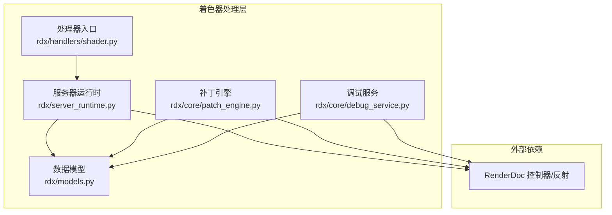
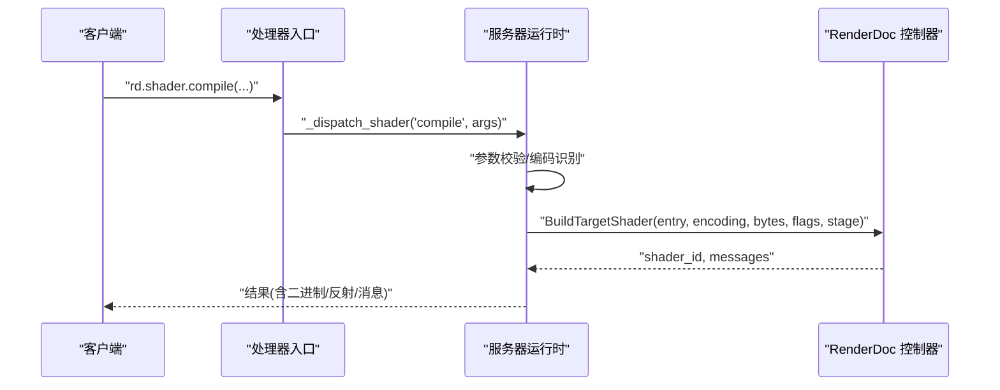
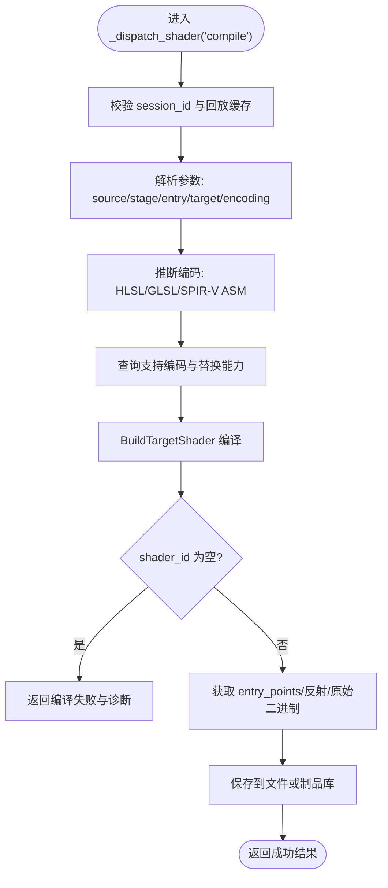
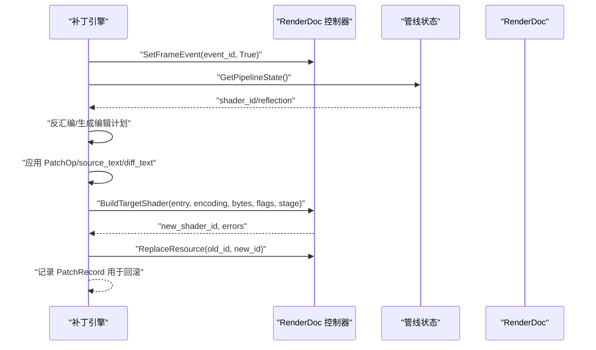
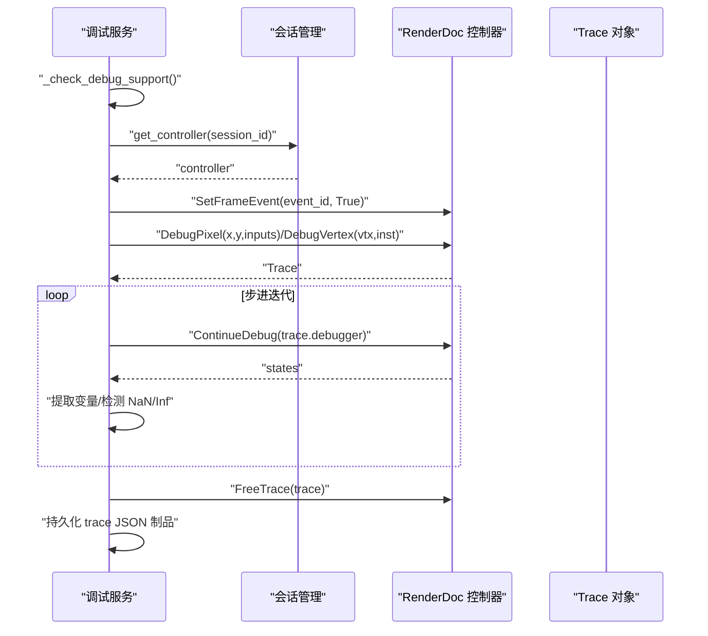
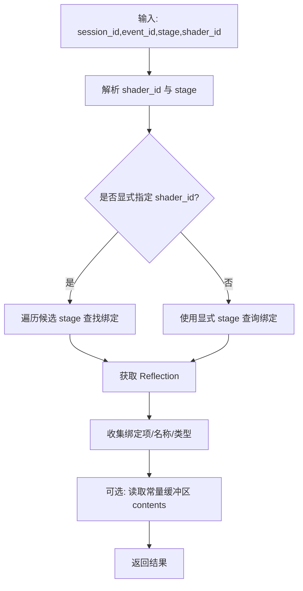
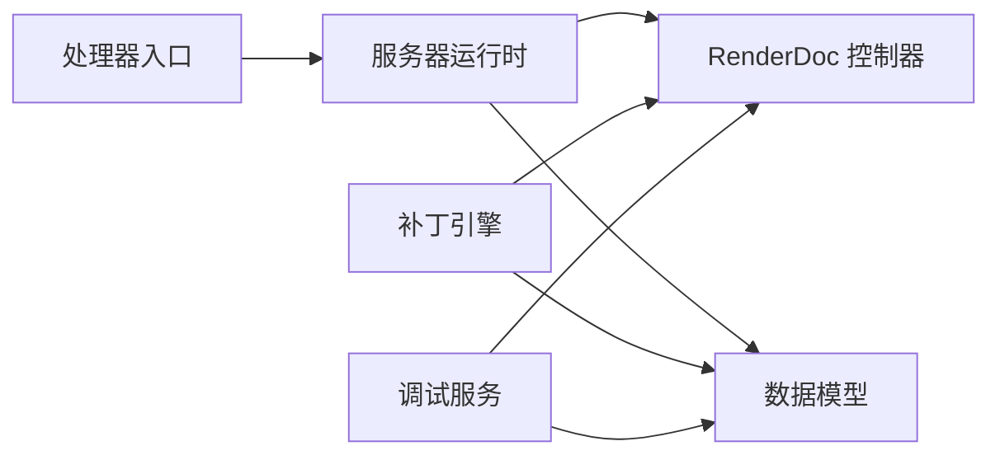
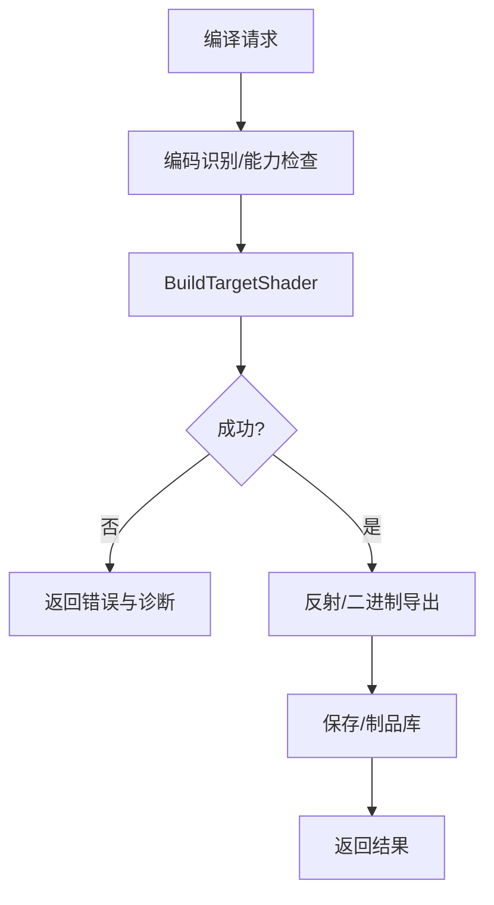

# 着色器处理器

<cite>
**本文档引用的文件**
- [rdx\handlers\shader.py](file://rdx/handlers/shader.py)
- [rdx\server_runtime.py](file://rdx/server_runtime.py)
- [rdx\core\patch_engine.py](file://rdx/core/patch_engine.py)
- [rdx\core\debug_service.py](file://rdx/core/debug_service.py)
- [rdx\models.py](file://rdx/models.py)
- [tests\test_shader_replace_contracts.py](file://tests/test_shader_replace_contracts.py)
- [tests\test_server_debug_paths.py](file://tests/test_server_debug_paths.py)
- [tests\test_texture_and_shader_event_binding.py](file://tests/test_texture_and_shader_event_binding.py)
</cite>

## 更新摘要
**所做更改**
- 更新了着色器调试系统的重大增强功能，包括完整的源代码替换功能
- 新增自动编码检测机制的详细说明
- 扩展了编译标志生成和编辑计划支持的功能描述
- 增强了调试服务的源代码替换能力和错误处理机制

## 目录
1. [简介](#简介)
2. [项目结构](#项目结构)
3. [核心组件](#核心组件)
4. [架构总览](#架构总览)
5. [详细组件分析](#详细组件分析)
6. [依赖分析](#依赖分析)
7. [性能考虑](#性能考虑)
8. [故障排查指南](#故障排查指南)
9. [结论](#结论)
10. [附录](#附录)

## 简介
本文件系统性阐述着色器处理器的设计与实现，覆盖以下主题：
- 着色器程序的编译、链接与执行处理机制
- 着色器源码解析、语法检查与编译优化
- 着色器变量绑定、Uniform 设置与着色器状态管理
- 着色器程序加载、参数传递与执行结果获取的实际使用示例
- 着色器调试、错误诊断与性能分析功能
- 着色器兼容性、版本管理与跨平台支持的实现细节

**更新** 本次更新重点增强了着色器调试系统的功能，包括完整的源代码替换能力、自动编码检测、编译标志生成和详细的编辑计划支持。

## 项目结构
着色器处理相关的核心代码分布在如下模块：
- 处理器入口与路由：rdx/handlers/shader.py
- 服务器运行时与编译/查询接口：rdx/server_runtime.py
- 源级补丁与热替换引擎：rdx/core/patch_engine.py
- 调试服务（像素/顶点步进、trace导出）：rdx/core/debug_service.py
- 数据模型与枚举：rdx/models.py
- 测试用例与契约验证：tests/*.py

**图表来源**
- [rdx\handlers\shader.py:1-11](file://rdx/handlers/shader.py#L1-L11)
- [rdx\server_runtime.py:9473-9618](file://rdx/server_runtime.py#L9473-L9618)
- [rdx\core\patch_engine.py:174-216](file://rdx/core/patch_engine.py#L174-L216)
- [rdx\core\debug_service.py:43-92](file://rdx/core/debug_service.py#L43-L92)
- [rdx\models.py:28-51](file://rdx/models.py#L28-L51)

**章节来源**
- [rdx\handlers\shader.py:1-11](file://rdx/handlers/shader.py#L1-L11)
- [rdx\server_runtime.py:9473-9618](file://rdx/server_runtime.py#L9473-L9618)
- [rdx\core\patch_engine.py:174-216](file://rdx/core/patch_engine.py#L174-L216)
- [rdx\core\debug_service.py:43-92](file://rdx/core/debug_service.py#L43-L92)
- [rdx\models.py:28-51](file://rdx/models.py#L28-L51)

## 核心组件
- 处理器入口：将"rd.shader.*"操作转发至服务器运行时，统一处理编译、查询、绑定等请求。
- 服务器运行时：负责参数校验、编码识别、调用 RenderDoc 控制器 BuildTargetShader、收集反射与二进制输出。
- 补丁引擎：在渲染回放中对 shader 源进行反汇编、编辑、编译与热替换，支持精度提升与插入保护性守卫等操作。
- 调试服务：封装 RenderDoc 的像素/顶点调试 API，支持逐步执行、trace采集与JSON持久化，现已增强源代码替换功能。
- 数据模型：定义 ShaderStage、PatchOp/PatchSpec、PatchResult、DebugStep、PixelDebugResult 等结构。

**更新** 调试服务现已支持完整的源代码替换功能，包括自动编码检测、编译标志生成和详细的编辑计划支持。

**章节来源**
- [rdx\handlers\shader.py:8-10](file://rdx/handlers/shader.py#L8-L10)
- [rdx\server_runtime.py:9473-9618](file://rdx/server_runtime.py#L9473-L9618)
- [rdx\core\patch_engine.py:174-216](file://rdx/core/patch_engine.py#L174-L216)
- [rdx\core\debug_service.py:43-92](file://rdx/core/debug_service.py#L43-L92)
- [rdx\models.py:316-359](file://rdx/models.py#L316-L359)

## 架构总览
着色器处理流程分为两大路径：
- 编译路径：客户端提交源码与参数 → 服务器运行时解析编码与目标 → 调用 BuildTargetShader → 返回二进制与反射信息。
- 源级修改路径：定位事件与绑定 → 反汇编/反编译源码 → 应用补丁操作 → 重新编译 → 热替换 → 回滚记录。

**图表来源**
- [rdx\handlers\shader.py:8-10](file://rdx/handlers/shader.py#L8-L10)
- [rdx\server_runtime.py:9473-9618](file://rdx/server_runtime.py#L9473-L9618)

**章节来源**
- [rdx\handlers\shader.py:8-10](file://rdx/handlers/shader.py#L8-L10)
- [rdx\server_runtime.py:9473-9618](file://rdx/server_runtime.py#L9473-L9618)

## 详细组件分析

### 组件A：着色器编译与查询（服务器运行时）
职责与流程：
- 参数校验：session_id、source、stage、entry、source_encoding、target 等。
- 编码识别：根据源内容或 target hint 推断编码（HLSL/GLSL/SPIR-V ASM）。
- 能力检查：确认会话支持的编码列表与是否可热替换。
- 编译：调用 BuildTargetShader，返回 shader_id 与编译消息。
- 反射与二进制：可选获取 entry_points、反射与原始二进制，支持落盘或存入制品库。

**图表来源**
- [rdx\server_runtime.py:9473-9618](file://rdx/server_runtime.py#L9473-L9618)

**章节来源**
- [rdx\server_runtime.py:9473-9618](file://rdx/server_runtime.py#L9473-L9618)

### 组件B：源级补丁与热替换（补丁引擎）
职责与流程：
- 定位事件与绑定：SetFrameEvent → GetPipelineState → GetShader/Reflection。
- 反汇编/反编译：选择最佳可编辑编码（如 SPIR-V ASM、HLSL/GLSL）。
- 编辑计划：评估是否可替换、允许的操作（如 force_full_precision、insert_guard）。
- 应用补丁：按 PatchOp 顺序应用（支持 source_text/diff_text/具体操作）。
- 重新编译与替换：BuildTargetShader → ReplaceResource → 记录 PatchRecord 以便回滚。
- 错误处理：区分致命错误与告警，清理中间资源。

**更新** 编辑计划现在包含更详细的源代码替换策略，包括自动编码检测和编译标志生成。

**图表来源**
- [rdx\core\patch_engine.py:195-216](file://rdx/core/patch_engine.py#L195-L216)
- [rdx\core\patch_engine.py:603-768](file://rdx/core/patch_engine.py#L603-L768)

**章节来源**
- [rdx\core\patch_engine.py:195-216](file://rdx/core/patch_engine.py#L195-L216)
- [rdx\core\patch_engine.py:603-768](file://rdx/core/patch_engine.py#L603-L768)

### 组件C：着色器调试（调试服务）
**更新** 调试服务现已大幅增强，支持完整的源代码替换功能：

能力与流程：
- 能力检测：基于 GraphicsAPI 与会话能力判断是否支持调试（D3D11/D3D12/Vulkan）。
- 自动编码检测：智能识别着色器源代码编码格式，支持 HLSL/GLSL/SPIR-V ASM 自动切换。
- 源代码替换：支持完整的源代码文本替换，包括语法高亮和格式保持。
- 编译标志生成：自动生成编译标志，确保替换后的着色器与原着色器兼容。
- 编辑计划支持：提供详细的编辑计划，包括替换前后的对比和潜在风险评估。
- 像素调试：DebugPixel → ContinueDebug 迭代状态，检测 NaN/Inf，支持"运行到首个 NaN/Inf"或"全量 trace"。
- 顶点调试：DebugVertex → ContinueDebug 迭代状态，采集步骤。
- 结果持久化：将 trace 写入 JSON 制品，便于离线分析。

**图表来源**
- [rdx\core\debug_service.py:54-267](file://rdx/core/debug_service.py#L54-L267)
- [rdx\core\debug_service.py:271-421](file://rdx/core/debug_service.py#L271-L421)

**章节来源**
- [rdx\core\debug_service.py:54-267](file://rdx/core/debug_service.py#L54-L267)
- [rdx\core\debug_service.py:271-421](file://rdx/core/debug_service.py#L271-L421)

### 组件D：着色器变量绑定与Uniform设置
- 绑定解析：根据 stage 与 shader_id 解析当前事件的绑定，支持显式指定 stage 或自动匹配。
- 反射增强：结合 shader reflection 丰富绑定项的名称与类型信息。
- 常量缓冲区内容：支持读取指定 slot 的常量缓冲区内容，返回扁平化字段与原始字节视图。

**图表来源**
- [rdx\server_runtime.py:9626-9707](file://rdx/server_runtime.py#L9626-L9707)
- [rdx\server_runtime.py:10611-10619](file://rdx/server_runtime.py#L10611-L10619)

**章节来源**
- [rdx\server_runtime.py:9626-9707](file://rdx/server_runtime.py#L9626-L9707)
- [rdx\server_runtime.py:10611-10619](file://rdx/server_runtime.py#L10611-L10619)

### 组件E：数据模型与契约
- ShaderStage：VS/HS/DS/GS/PS/CS/MS/AS
- PatchOp/PatchSpec：描述补丁操作（精度提升、插入守卫、直接替换等）
- PatchResult：标准化补丁执行结果与错误详情
- DebugStep/PixelDebugResult：调试轨迹与结果封装
- ShaderInfo/ResourceBindingEntry：着色器与资源绑定信息

**更新** 数据模型现已扩展以支持新的调试功能，包括源代码替换的状态跟踪和编译标志信息。

**章节来源**
- [rdx\models.py:42-51](file://rdx/models.py#L42-L51)
- [rdx\models.py:316-359](file://rdx/models.py#L316-L359)
- [rdx\models.py:224-239](file://rdx/models.py#L224-L239)

## 依赖分析
- 处理器入口依赖服务器运行时，统一调度编译与查询。
- 服务器运行时依赖 RenderDoc 控制器进行编译与反射查询。
- 补丁引擎依赖服务器运行时提供的控制器与管线状态，同时复用数据模型。
- 调试服务依赖 RenderDoc 控制器与制品存储，输出 JSON 轨迹，现已增强源代码替换能力。
- 测试用例覆盖编译契约、补丁编译标志克隆、常量缓冲区读取等场景。

**图表来源**
- [rdx\handlers\shader.py:8-10](file://rdx/handlers/shader.py#L8-L10)
- [rdx\server_runtime.py:9473-9618](file://rdx/server_runtime.py#L9473-L9618)
- [rdx\core\patch_engine.py:174-216](file://rdx/core/patch_engine.py#L174-L216)
- [rdx\core\debug_service.py:43-92](file://rdx/core/debug_service.py#L43-L92)
- [rdx\models.py:316-359](file://rdx/models.py#L316-L359)

**章节来源**
- [rdx\handlers\shader.py:8-10](file://rdx/handlers/shader.py#L8-L10)
- [rdx\server_runtime.py:9473-9618](file://rdx/server_runtime.py#L9473-L9618)
- [rdx\core\patch_engine.py:174-216](file://rdx/core/patch_engine.py#L174-L216)
- [rdx\core\debug_service.py:43-92](file://rdx/core/debug_service.py#L43-L92)
- [rdx\models.py:316-359](file://rdx/models.py#L316-L359)

## 性能考虑
- 编译与替换成本：BuildTargetShader 与 ReplaceResource 为重操作，建议在必要时才应用补丁。
- 调试上限：调试步数存在硬上限，避免无限循环导致资源泄漏。
- 反射与二进制导出：反射与原始二进制导出会增加 IO 与内存开销，按需启用。
- 编译标志克隆：从反射中克隆编译标志可减少手工配置误差，提高一致性。
- 源代码替换优化：新增的自动编码检测和编译标志生成功能可能增加少量处理开销，但显著提升了调试效率。

**更新** 新增的调试功能在性能上进行了优化，自动编码检测采用缓存机制，编译标志生成使用预定义模板，确保性能影响最小化。

## 故障排查指南
常见问题与定位要点：
- 编码不支持：检查 requested_encoding 是否在会话支持列表内；DXIL/DXBC 需二进制容器输入。
- 编译失败：关注 BuildTargetShader 返回的 shader_id 是否为空，查看 messages 与错误详情。
- 绑定解析失败：确认 event_id 下对应 stage 是否绑定了 shader，或传入的 shader_id 是否匹配。
- 调试不可用：确认 GraphicsAPI 是否受支持（D3D11/D3D12/Vulkan），否则降级处理。
- 热替换失败：若替换后 rebind 失败，引擎会尝试移除替换并释放资源，需检查上下文状态。
- 源代码替换失败：检查编辑计划中的 blocked_reason，确认源代码编码是否安全可替换。
- 自动编码检测异常：验证着色器源代码格式，确保能够被正确识别为 HLSL/GLSL/SPIR-V ASM。

**更新** 新增了源代码替换和自动编码检测相关的故障排查指导。

**章节来源**
- [rdx\server_runtime.py:9514-9555](file://rdx/server_runtime.py#L9514-L9555)
- [rdx\server_runtime.py:9645-9691](file://rdx/server_runtime.py#L9645-L9691)
- [rdx\core\debug_service.py:94-102](file://rdx/core/debug_service.py#L94-L102)
- [rdx\core\patch_engine.py:728-787](file://rdx/core/patch_engine.py#L728-L787)

## 结论
着色器处理器通过清晰的分层设计实现了从编译、查询到源级修改与调试的全链路能力。服务器运行时负责参数校验与与 RenderDoc 的交互，补丁引擎提供可控的源级修改与热替换，调试服务支撑高效的 NaN/Inf 定位与 trace 分析。**更新** 最新版本的调试服务大幅增强了源代码替换功能，包括自动编码检测、编译标志生成和详细的编辑计划支持，显著提升了着色器调试的效率和准确性。配合完善的数据模型与测试契约，系统在跨平台与多图形 API 场景下具备良好的稳定性与可维护性。

## 附录

### 实际使用示例（路径引用）
- 编译着色器示例（CLI 调用）：[tests\test_server_debug_paths.py:442-457](file://tests/test_server_debug_paths.py#L442-L457)
- 补丁编译标志克隆测试：[tests\test_shader_replace_contracts.py:1017-1041](file://tests/test_shader_replace_contracts.py#L1017-L1041)
- 常量缓冲区读取示例：[tests\test_texture_and_shader_event_binding.py:226-243](file://tests/test_texture_and_shader_event_binding.py#L226-L243)

### 关键流程图（再次呈现）

**图表来源**
- [rdx\server_runtime.py:9473-9618](file://rdx/server_runtime.py#L9473-L9618)